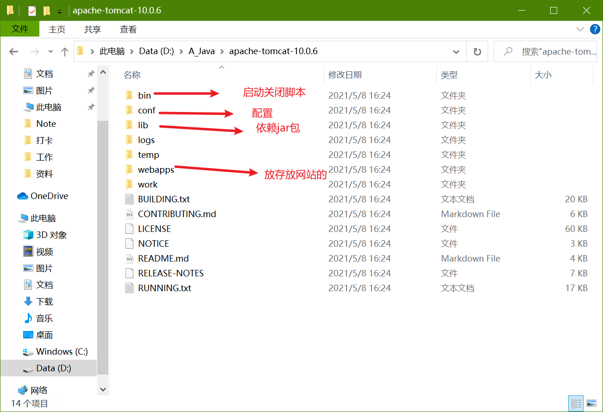
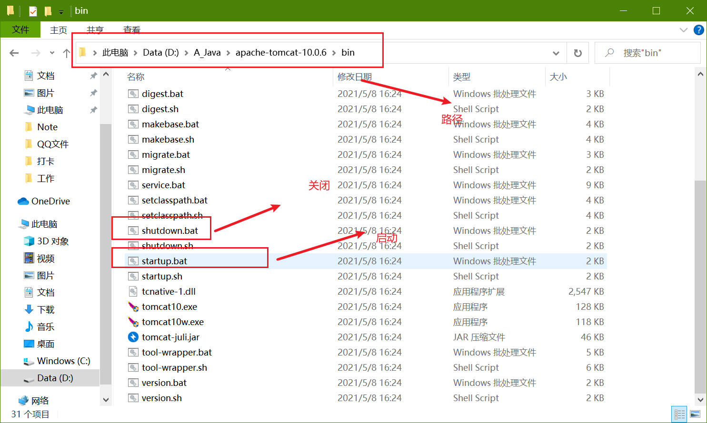

# JavaWeb

# 1. 基本概念

## 1.1 前言

web开发：

- web，网页的意思，www.baidu.com
- 静态web
  - html，css
  - 提供给所有人看到的数据始终不会发生变化
- 动态web
  - 淘宝，几乎所有的网站
  - 提供给所有人看的数据会发生变化，每个人在不同时间不同地点看到的信息各不相同！
  - 技术栈：Servlet/JSP,ASP,PHP

在Java中，动态web资源开发的技术称为JavaWeb；

## 1.2 web应用程序

web应用程序：可以提供浏览器访问的程序；

- a.html等，多个web资源，这些web资源可以被外界访问，对外界提供服务；
- 能访问到的任何页面或资源，都存在于一个计算机上
- URL
- 这个统一的web资源会被放在同一个文件夹下，web应用程序-->Tomcat:服务器
- 一个web应用由多个部分组成（静态web，动态web）
  - html,css,js
  - jsp,sesrvlet
  - java程序
  - jar包

web应用程序编写完毕以后，若想提供给外界访问，需要服务器来统一管理；

## 1.3 静态web

- `*.htm,\*.html`,如果服务器上存在这些东西，我们就可以直接读取，通过网络；
- `request`:请求  `response`:响应
- 静态web存在的缺点
  - web页面无法动态更新，所有用户看到的都是同一个页面
    - 轮播图，点击特效：伪动态
    - JavaScript[实际开发中，用的最多]
    - VbScript
  - 它无法与数据库交互（数据无法持久化，用户无法交互）

## 1.4 动态web

页面会动态展示：”web的页面展示因人而异“

缺点：

- 假如服务器的动态web出现错误，我们需要重新编写我们的**后台程序**，重新发布；
  - 停机维护，宕机

优点：

- 可以动态更新
- 可以与数据库交互（数据持久化）

# 2. web服务器

## 2.1 技术讲解

ASP:

- 微软：国内最早流行ASP
- 在html中嵌入了VB的脚本，ASP+COM；
- 在ASP开发中，基本一个页面有几千行业务代码，页面混乱
- 维护成本高
- C#
- IIS

PHP:

- 开发速度快，功能强大，跨平台，代码简单。
- 无法承载大访问量的情情况（局限性）

JSP/Servlet:

B/S:浏览器和服务器

C/S:客户端和服务器

- sun公司主推的B/S架构
- 基于Java语言的（所有的大公司，或者一些开源组件，都是使用Java改的）
- 可以承载三高（高并发，高可用，高性能）带来的影响
- 语法像ASP，ASP-->JSP,加强市场强度

## 2.2 服务器

服务器是一种被动的操作，用来处理用户的一些请求额和给用户一些响应信息

**IIS**

- 微软的：ASP...,windows自带的

**Tomcat**

下载tomcat

1. 安装 or 解压
2. 了解配置文件及目录结构
3. 作用

# 3. Tomcat

## 3.1 下载与安装



## 3.2 Tomcat启动



## 3.3 Tomcat配置

可以配置启动的端口号

- tomcat默认端口号：8080
- MySQL默认端口号：3306
- Oracle默认端口号：1521
- http:80
- https:443

可以配置主机名称

- 默认的主机名为：localhost->127.0.0.1
- 默认网站存放的位置为：webapps

### 高难度面试

请你谈谈网站时如何进行访问的

1. 输入一个域名；回车
2. 检查本机的C:\Windows\System32\drivers\hosts配置文件下有没有这个域名映射；
   1. 有：直接返回对应的ip地址，这个地址中，有我们需要访问的web程序，可以直接访问
   2. 没有：去DNS服务器找

## 3.4 发布一个web网站

- 将自己写的网站放到服务器（Tomcat）中指定的web应用的文件夹（webapps）下，就可以访问了

网站应该有的结构

```java
--webapp:TOmcat服务器的web目录
    - Root
    - dy
    	- WEB-INF
    		-classes:Java程序
            -lib：web应用所以来的jar包
            -web.xml:网站配置文件
    	- index.html 默认的主页
        - static
            -css
                - style.css
            -js
                - index.js
            -img
                ......
```

# 4. http

## 4.1 什么是http

HTTP（超文本传输协议）是一个简单的请求-响应协议，它通常运行在TCP之上

- 文本：html，字符串，...
- 超文本：图片，音乐，视频，定位，地图...
- 80

HTTPS：安全的

- 443

## 4.2 两个时代

- http1.0
  - HTTP/1.0:客户端可以与web服务器连接，只能获得一个web资源，断开连接
- http2.0
  - HTTP/1.1：客户端可以与web服务器连接，可以获得多个web资源

## 4.3 HTTP请求

- 客户端---发请求---响应

```java
Request URL:xxxx /请求地址
get方法/post方法
状态码
Remote(远程)
```

### 1. 请求行

- 请求行中的请求方式：GET
- 请求方式：GET,POST
  - Get:请求能够携带的参数比较少，大小有限制，会在浏览器的URL地址栏显示出来，不安全但是高效
  - Post:请求能够携带的参数没有限制，大小没有限制，不会显示，安全，但是不高效

### 2. 消息头

```
Accept:告诉浏览器，它支持的数据类型
Accept-Encoding:支持哪一种编码格式，GBK，UTF-8，GB2312
Accept-Language:告诉浏览器，它的语言环境
Cache-Control:缓存控制
Connection:告诉浏览器，请求完成时断开还是保持连接
```

## 4.4 HTTP响应

- 服务器---响应---客户端

### 1. 响应体

```
Accept:告诉浏览器，它支持的数据类型
Accept-Encoding:支持哪一种编码格式，GBK，UTF-8，GB2312
Accept-Language:告诉浏览器，它的语言环境
Cache-Control:缓存控制
Connection:告诉浏览器，请求完成时断开还是保持连接
HOST:主机
Refresh:告诉客户端，多久刷新一次
Location：让网页重新定位
```

## 2. 响应状态码

2xx：请求响应成功   200

3XX：请求重定向

- 重定向：重新到新的位置

4xx：找不到资源   404

- 资源不存在

5xx:服务器代码错误  500 502：网关错误


常见面试题：

当你的浏览器中地址栏输入地址并回车以后到页面展示出来，经历了什么

## 5. Maven

