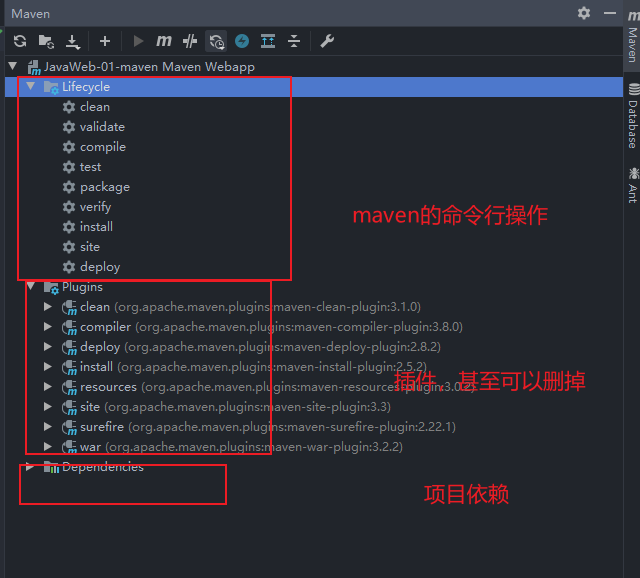

# JavaWeb

# 1. 基本概念

## 1.1 前言

web开发：

- web，网页的意思，www.baidu.com
- 静态web
  - html，css
  - 提供给所有人看到的数据始终不会发生变化
- 动态web
  - 淘宝，几乎所有的网站
  - 提供给所有人看的数据会发生变化，每个人在不同时间不同地点看到的信息各不相同！
  - 技术栈：Servlet/JSP,ASP,PHP

在Java中，动态web资源开发的技术称为JavaWeb；

## 1.2 web应用程序

web应用程序：可以提供浏览器访问的程序；

- a.html等，多个web资源，这些web资源可以被外界访问，对外界提供服务；
- 能访问到的任何页面或资源，都存在于一个计算机上
- URL
- 这个统一的web资源会被放在同一个文件夹下，web应用程序-->Tomcat:服务器
- 一个web应用由多个部分组成（静态web，动态web）
  - html,css,js
  - jsp,sesrvlet
  - java程序
  - jar包

web应用程序编写完毕以后，若想提供给外界访问，需要服务器来统一管理；

## 1.3 静态web

- `*.htm,\*.html`,如果服务器上存在这些东西，我们就可以直接读取，通过网络；
- `request`:请求  `response`:响应
- 静态web存在的缺点
  - web页面无法动态更新，所有用户看到的都是同一个页面
    - 轮播图，点击特效：伪动态
    - JavaScript[实际开发中，用的最多]
    - VbScript
  - 它无法与数据库交互（数据无法持久化，用户无法交互）

## 1.4 动态web

页面会动态展示：”web的页面展示因人而异“

缺点：

- 假如服务器的动态web出现错误，我们需要重新编写我们的**后台程序**，重新发布；
  - 停机维护，宕机

优点：

- 可以动态更新
- 可以与数据库交互（数据持久化）

# 2. web服务器

## 2.1 技术讲解

ASP:

- 微软：国内最早流行ASP
- 在html中嵌入了VB的脚本，ASP+COM；
- 在ASP开发中，基本一个页面有几千行业务代码，页面混乱
- 维护成本高
- C#
- IIS

PHP:

- 开发速度快，功能强大，跨平台，代码简单。
- 无法承载大访问量的情情况（局限性）

JSP/Servlet:

B/S:浏览器和服务器

C/S:客户端和服务器

- sun公司主推的B/S架构
- 基于Java语言的（所有的大公司，或者一些开源组件，都是使用Java改的）
- 可以承载三高（高并发，高可用，高性能）带来的影响
- 语法像ASP，ASP-->JSP,加强市场强度

## 2.2 服务器

服务器是一种被动的操作，用来处理用户的一些请求额和给用户一些响应信息

**IIS**

- 微软的：ASP...,windows自带的

**Tomcat**

下载tomcat

1. 安装 or 解压
2. 了解配置文件及目录结构
3. 作用

# 3. Tomcat

## 3.1 下载与安装


## 3.2 Tomcat启动


## 3.3 Tomcat配置

可以配置启动的端口号

- tomcat默认端口号：8080
- MySQL默认端口号：3306
- Oracle默认端口号：1521
- http:80
- https:443

可以配置主机名称

- 默认的主机名为：localhost->127.0.0.1
- 默认网站存放的位置为：webapps

### 高难度面试

请你谈谈网站时如何进行访问的

1. 输入一个域名；回车
2. 检查本机的C:\Windows\System32\drivers\hosts配置文件下有没有这个域名映射；
   1. 有：直接返回对应的ip地址，这个地址中，有我们需要访问的web程序，可以直接访问
   2. 没有：去DNS服务器找

## 3.4 发布一个web网站

- 将自己写的网站放到服务器（Tomcat）中指定的web应用的文件夹（webapps）下，就可以访问了

网站应该有的结构

```java
--webapp:TOmcat服务器的web目录
    - Root
    - dy
    	- WEB-INF
    		-classes:Java程序
            -lib：web应用所以来的jar包
            -web.xml:网站配置文件
    	- index.html 默认的主页
        - static
            -css
                - style.css
            -js
                - index.js
            -img
                ......
```

# 4. http

## 4.1 什么是http

HTTP（超文本传输协议）是一个简单的请求-响应协议，它通常运行在TCP之上

- 文本：html，字符串，...
- 超文本：图片，音乐，视频，定位，地图...
- 80

HTTPS：安全的

- 443

## 4.2 两个时代

- http1.0
  - HTTP/1.0:客户端可以与web服务器连接，只能获得一个web资源，断开连接
- http2.0
  - HTTP/1.1：客户端可以与web服务器连接，可以获得多个web资源

## 4.3 HTTP请求

- 客户端---发请求---响应

```java
Request URL:xxxx /请求地址
get方法/post方法
状态码
Remote(远程)
```

### 1. 请求行

- 请求行中的请求方式：GET
- 请求方式：GET,POST
  - Get:请求能够携带的参数比较少，大小有限制，会在浏览器的URL地址栏显示出来，不安全但是高效
  - Post:请求能够携带的参数没有限制，大小没有限制，不会显示，安全，但是不高效

### 2. 消息头

```
Accept:告诉浏览器，它支持的数据类型
Accept-Encoding:支持哪一种编码格式，GBK，UTF-8，GB2312
Accept-Language:告诉浏览器，它的语言环境
Cache-Control:缓存控制
Connection:告诉浏览器，请求完成时断开还是保持连接
```

## 4.4 HTTP响应

- 服务器---响应---客户端

### 1. 响应体

```
Accept:告诉浏览器，它支持的数据类型
Accept-Encoding:支持哪一种编码格式，GBK，UTF-8，GB2312
Accept-Language:告诉浏览器，它的语言环境
Cache-Control:缓存控制
Connection:告诉浏览器，请求完成时断开还是保持连接
HOST:主机
Refresh:告诉客户端，多久刷新一次
Location：让网页重新定位
```

## 2. 响应状态码

2xx：请求响应成功   200

3XX：请求重定向

- 重定向：重新到新的位置

4xx：找不到资源   404

- 资源不存在

5xx:服务器代码错误  500 502：网关错误


常见面试题：

当你的浏览器中地址栏输入地址并回车以后到页面展示出来，经历了什么

# 5. Maven

 **我为什么要学习这个技术**

1. 在Javaweb开发中，需要使用大量的jar包，我们手动去导入
2. 如何能够让一个东西 自动帮我导入和配置这个jar包

## 5.1 Maven项目架构管理工具

我们目前用来方便导入jar包

Maven的核心内容：**约定大于配置**

- 有约束，不要去违反

Maven会规定好你该如何去编写我们的Java代码，必须按照这个规范来

## 5.2 下载安装Maven

建议：电脑上的所有环境都放在一个文件夹下

## 5.3 配置环境变量

在系统环境变量中，配置如下配置

- `M2_HOME`:maven目录下的bin目录
- `MAVEN_HOME`：Maven目录
- 在系统的path中配置%MAVEN_HOME%\bin

## 5.4 阿里云镜像

- 镜像：mirrors
  - 作用：加速我们的下载

```xml
<mirror>
    <id>nexus-aliyun</id>
    <mirrorOf>*,!jeecg,!jeecg-snapshots</mirrorOf>
    <name>Nexus aliyun</name>
    <url>http://maven.aliyun.com/nexus/content/groups/public</url>
</mirror>
```

## 5.5 本地仓库

在本地的仓库，远程仓库；

- 建立一个本地仓库

```xml
<localRepository>E:\Java\apache-maven-3.6.1\maven-repo</localRepository>
```

## 5.6 在IDEA中使用Maven

1. 启动idea
2. 创建一个Maven项目


4. 观察Maven仓库

5. IDEA中的Maven设置

   idea项目创建成功后，看一眼Maven配置事项


6. 到这里Maven在idea中的配置和使用就OK了

## 5.7 创建一个普通的Maven项目

## 5.8 标记文件夹功能


## 5.9 在idea中配置Tomcat


解决警告问题：

为什么会有这个问题：我们访问一个网站，**需要指定一个文件夹名字**


启动Tomcat


## 5.10 pom文件

pm.xml是Maven的核心配置



maven由于他的约定大于配置，我们之后可能遇到我们写的配置文件，无法被导出或者生效的问题，

```xml
<!--在build中配置resources，来防止我们资源导出失败的问题-->
<build>
    <resources>
        <resource>
            <directory>src/main/resources</directory>
            <includes>
                <include>**/*.properties</include>
                <include>**/*.xml</include>
            </includes>
            <filtering>true</filtering>
        </resource>
        <resource>
            <directory>src/main/java</directory>
            <includes>
                <include>**/*.properties</include>
                <include>**/*.xml</include>
            </includes>
            <filtering>false</filtering>
        </resource>
    </resources>
</build>
```

## 5.12 idea操作

# 6. Servlet

## 6.1 servlet简介

- Servlet是sun公司开发动态web的一门技术
- Sun在这些API中提供了一个接口叫做：Servlet，如果你想开发一个Servlet程序，只需要完成两个步骤
  - 编写一个类，实现Servlet接口
  - 把开发好的Java类部署到Web服务器中

**把实现了Servlet接口的Java程序叫做，Servlet**

## 6.2 HelloServlet

servlet接口sun公司有两个默认的实现类：HttpServlet,GenericServlet


1. 构建一个Maven项目，删掉里面的src目录，以后我们的学习就在这个项目里面建立，这个空的工程就是maven主工程

2. 关于Maven父子工程的理解:

   ```xml
   <modules>
   	<module>servlet-01</module>
   </modules>
   ```

   子项目会有

   ```xml
   <parent>
   	<artifactId>javaweb-02-servlet</artifactId>
       <groupId>com.duye</groupId>
       <version>1.0-SNAPSHOT</version>
   </parent>
   ```

   父项目中的java子项目可以直接使用

   ```java
   son extends father
   ```

3. Maven环境优化

   1. 修改web.xml为最新的
   2. 将maven的结构搭建完整

4. 编写一个Servelet程序

   1. 编写一个普通类

   2. 实现Servlet接口，这里我们直接继承HttpServlet

   3. ```java
      public class HelloServlet extends HttpServlet {
      
          // 由于get或者post只是请求实现的不同方式，可以互相调用，业务逻辑都一样
          @Override
          protected void doGet(HttpServletRequest req, HttpServletResponse resp) throws ServletException, IOException {
              PrintWriter writer = resp.getWriter();// 响应流
              writer.println("hello,Servlet");
      //        ServletOutputStream outputStream = resp.getOutputStream();
          }
      
          @Override
          protected void doPost(HttpServletRequest req, HttpServletResponse resp) throws ServletException, IOException {
              doGet(req, resp);
          }
      }
      ```

5. 编写Servlet的映射

   为什么需要映射：我们写的是java程序，但是要通过浏览器访问，而浏览器访问需要链接web服务器，所以我们需要再web服务中注册我们写的Servlet，还需要给他一个浏览器能够访问的路径

   ```xml
   <!--  注册Servlet-->
     <servlet>
       <servlet-name>hello</servlet-name>
       <servlet-class>com.duye.servlet.HelloServlet</servlet-class>
     </servlet>
   <!--  Servlet的请求路径-->
     <servlet-mapping>
       <servlet-name>hello</servlet-name>
       <url-pattern>/hello</url-pattern>
     </servlet-mapping>
   ```

6. 配置Tomcat

   ​	注意：配置项目发布的路径就可以了

## 6.3 Servlet原理

Servlet是由Web服务器调用，web服务器在收到浏览器请求之后，会：

## 6.4 Mapping问题

1. 一个servlet可以指定通用映射路径

```xml
<servlet-mapping>
	<servlet-name>hello</servlet-name>
    <url-pattern>/hello/*</url-pattern>
</servlet-mapping>
```

2. 默认请求路径

```xml
<servlet-mapping>
	<servlet-name>hello</servlet-name>
    <url-pattern>/*</url-pattern>
</servlet-mapping>
```

3. 可以自定义后缀实现请求映射

   - *前面不能加映射路径

   ```xml
   <servlet-mapping>
   	<servlet-name>hello</servlet-name>
       <url-pattern>*.hello</url-pattern>
   </servlet-mapping>
   ```

   

4. 优先级问题
   1. 指定了固有的映射路径优先级最高，如果找不到就会走默认的路径

## 6.5 ServletContext

### 什么是ServletContext

1. ServletContext是一个接口，它表示Servlet上下文对象

2. 一个web工程，只有一个ServletContext对象实例。

3. ServletContext是一个域对象

   1. 什么是域对象

      可以像Map一样，存取数据的对象，叫域对象

      这里的域指的是存取数据的操作范围

**ServletContext类的四个作用**

1. 获取web.xml中配置的上下文参数context-param

2. 获取当前工程路径，格式：/工程路径
3. 获取共亨部署后在服务器硬盘上的绝对路径
4. 向Map一样存储数据

web容器在启动的时候，它会为每个web程序都创建一个对应的ServletContext对象，它代表了当前的web应用；

### 1. 共享数据

我在Servlet中保存的数据，可以在另一个servlet中访问。

```java
// 放置context部分
public class HelloServlet extends HttpServlet {
    @Override
    protected void doGet(HttpServletRequest req, HttpServletResponse resp) throws ServletException, IOException {
        //this.getInitParameter() 初始化参数
        //this.getServletConfig();servlet配置
        //this.getServletContext(); Servlet上下文
        ServletContext context = this.getServletContext();
        String UserName = "杜也";// 数据
        context.setAttribute("UserName",UserName);// 将一个数据保存在ServletContext中，名字为：username,值username
        System.out.println("hello");
    }
}
```

```java
// 读取context
public class getServlet extends HttpServlet {
    @Override
    protected void doGet(HttpServletRequest req, HttpServletResponse resp) throws ServletException, IOException {
        ServletContext context = this.getServletContext();
        String username = (String) context.getAttribute("UserName");

        // 它会同时设置服务器和客户端都使用utf-8字符集，还设置了响应头
        // 此方法一定要在获取流对象之前调用
        resp.setContentType("text/html;utf-8");
        resp.getWriter().println("名字 ：" + username);
    }

    @Override
    protected void doPost(HttpServletRequest req, HttpServletResponse resp) throws ServletException, IOException {
        doGet(req, resp);
    }
}
```

配置web.xml

```xml
<servlet>
        <servlet-name>hello</servlet-name>
        <servlet-class>com.duye.servlet.HelloServlet</servlet-class>
    </servlet>
    <servlet-mapping>
        <servlet-name>hello</servlet-name>
        <url-pattern>/hello</url-pattern>
    </servlet-mapping>

    <servlet>
        <servlet-name>getc</servlet-name>
        <servlet-class>com.duye.servlet.getServlet</servlet-class>
    </servlet>
    <servlet-mapping>
        <servlet-name>getc</servlet-name>
        <url-pattern>/getc</url-pattern>
    </servlet-mapping>
```

### 2.获取初始化参数

```xml
配置xml
<context-param>
    <param-name>url</param-name>
    <param-value>jdbc:mysql://localhost:3306/test</param-value>
</context-param>
```

```java
protected void doGet(HttpServletRequest req, HttpServletResponse resp) throws ServletException, IOException {
    ServletContext context = this.getServletContext();
    String url = context.getInitParameter("url");
    resp.getWriter().println(url);
}
```

### 3. 请求转发

```java
protected void doGet(HttpServletRequest req, HttpServletResponse resp) throws ServletException, IOException {
    ServletContext context = this.getServletContext();
    System.out.println("进入了servlet");
    //context.getRequestDispatcher("/gp");// 转发请求路路径
    // forward(req,resp);// 调用forward实现请求转发
    context.getRequestDispatcher("/gp").forward(req,resp);
}
```

### 4. 读取资源文件

`Properties`

- 在Java目录下新建Properties
- 在resources目录下新建properties

发现：都被打包到了同一个路径下：classes，我们俗称这个路径为class path

```properties
username=root
password=root
```


```java
protected void doPost(HttpServletRequest req, HttpServletResponse resp) throws ServletException, IOException {
    InputStream is = this.getServletContext().getResourceAsStream("/WEB-INF/classes/db.properties");
    Properties properties = new Properties();
    properties.load(is);
    String username = properties.getProperty("username");
    String password = properties.getProperty("password");
    resp.getWriter().println(username + " " + password);
}
```

访问测试即可。

## 6.5 HttpServletResponse

web服务器接收到客户端的http请求，针对这个请求，分别创建一个代表请求的HttpServletRequest对象，代表响应的一个HttpServletResponse;

- 如果要获取客户端请求过来的参数：找HTTP ServletResquest
- 如果要给客户端响应一些信息：找HTTP Servlet Response

### **请求重定向**

请求重定向:是指客户端给服务器发请求，然后服务器告诉客户端说，我给你发地址，然后你去新地址访问。叫请求重定向（原地址有可能废弃）

## 6.6 HttpServletRequest

**常见应用**

1. 向浏览器输出信息
2. 下载文件
   1. 获取下载文件的路径
   2. 下载的文件名是啥
   3. 设置想办法让浏览器能够支持下载我们需要的东西
   4. 获取下载文件的输入流
   5. 创建缓冲流
   6. 获取Output Stream对象
   7. 将FileOutputStream流写入到缓冲区（buffer）
   8. 使用OutputSteam将缓冲区的数据输出到客户端