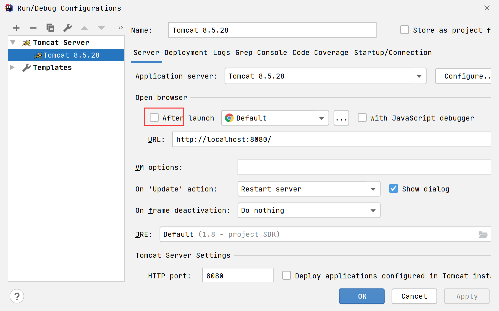

# J2EE

J2EE: 分布式开发平台的标准

servlet：基于 J2EE标准的API

目标：

1. 使用maven部署servlet环境
2. 使用 servlet 实现简单的CURD

# maven

工程结构


pom.xml: 配置简介

```xml
<properties>
    <!--编码-->
    <project.build.sourceEncoding>UTF-8</project.build.sourceEncoding>
    <!--编译的源版本：环境版本-->
    <maven.compiler.source>1.8</maven.compiler.source>
    <!--编译的目标版本-->
    <maven.compiler.target>1.8</maven.compiler.target>
</properties>

<dependencies>
    <dependency>
        <groupId>junit</groupId>
        <artifactId>junit</artifactId>
        <version>4.11</version>
        <!--只可以在 test 目录下引用-->
        <scope>test</scope>
    </dependency>

    <dependency>
        <groupId>mysql</groupId>
        <artifactId>mysql-connector-java</artifactId>
        <version>8.0.17</version>
    </dependency>

</dependencies>

<!--工具配置-->
<build>
    <plugins>
        <!--配置编译工具-->
        <plugin>
            <groupId>org.apache.maven.plugins</groupId>
            <artifactId>maven-compiler-plugin</artifactId>
            <version>3.8.1</version>
            <configuration>
                <source>1.8</source>
                <target>1.8</target>
            </configuration>
        </plugin>
        <!--配置打包工具-->
        <plugin>
            <groupId>org.apache.maven.plugins</groupId>
            <artifactId>maven-jar-plugin</artifactId>
            <configuration>
                <archive>
                    <manifest>
                        <addClasspath>true</addClasspath>
                        <!--   MANIFEST.MF 中 Class-Path -->
                        <classpathPrefix>lib/</classpathPrefix>
                        <mainClass>com.iweb.test.User</mainClass>
                    </manifest>
                </archive>
            </configuration>
        </plugin>
    </plugins>
</build>
```


# Servlet入门程序（环境部署）

1. 构建maven工程选择 ： `maven-archetype-webapp`;

   

2. 配置pom.xml

   修改JDK版本：1.8

   ```xml
   <properties>
       <project.build.sourceEncoding>UTF-8</project.build.sourceEncoding>
       <maven.compiler.source>1.8</maven.compiler.source>
       <maven.compiler.target>1.8</maven.compiler.target>
   </properties>
   ```

   引入servlet的依赖

   ```xml
   <dependency>
       <groupId>javax.servlet</groupId>
       <artifactId>javax.servlet-api</artifactId>
       <version>3.1.0</version>
   </dependency>
   ```

3. 编写服务端代码： com.iweb.servlet.UserServlet 继承 HttpServlet，并重写service方法

   ```java
   @Override
   protected void service(HttpServletRequest req, HttpServletResponse resp) throws ServletException, IOException {
       // 业务方法
       System.out.println("service");
       // 获取用户请求的 url
       String url = req.getRequestURI();
       System.out.println("url:" + url);
   
       // 获取用户请求的数据 : http://localhost:8080/login?username=jack&password=111
       String username = req.getParameter("username");
       String password = req.getParameter("password");
       System.out.println(username + "\t" + password);
   
       // 转发视图
       req.getRequestDispatcher("/main.html").forward(req, resp);
   }
   ```

4. 配置web.xml

   ```xml
   <servlet>
       <servlet-name>user</servlet-name>
       <!--com.iweb.servlet.UserServlet和上面的业务类对应-->
       <servlet-class>com.iweb.servlet.UserServlet</servlet-class>
   </servlet>
   <!--servlet映射-->
   <servlet-mapping>
       <servlet-name>user</servlet-name>
       <url-pattern>/login</url-pattern>
   </servlet-mapping>
   ```

5. 编写请求页面index.html和返回页面main.html

   index.html

   ```html
   <form action="/login" method="get">
       <label for="username">username:</label>
       <input type="text" name="username" id="username">
       <label for="password">username:</label>
       <input type="text" name="password" id="password">
       <input type="submit" value="登录">
   </form>
   ```

   main.html

   ```html
   <h1>main</h1>
   ```

6. 通过idea部署

   





修改 应用的根路径为 /


**请求访问的原理：**

1. 用户从页面发起一个 http request请求
2. 通过请求url找到对应的 servlet 业务类
3. 执行业务类中的 service 方法


# 修改idea的maven仓库的地址

修改settings.xml


在mirrors节点中添加如下内容：


```xml
<mirror>
  <id>alimaven</id>
  <name>aliyun maven</name>
  <url>http://maven.aliyun.com/nexus/content/groups/public/</url>
  <mirrorOf>central</mirrorOf>        
</mirror>
```


jar包的管理


# 使用注解的方式构建工程

业务场景：index.html 登录，验证成功后，返回 main.html

1. 删除web.xml
2. 添加依赖
3. 编写业务类：UserServlet

```java
@WebServlet(urlPatterns = "/login") // http://127.0.0.1:8080/login
public class UserServlet extends HttpServlet {

    @Override
    protected void service(HttpServletRequest req, HttpServletResponse resp) throws ServletException, IOException {
        // TO DO
        String username = req.getParameter("username");
        String password = req.getParameter("password");

        // 链接数据库 使用 JDBC 进行用户认证：模拟
        if (!"admin".equals(username)) {
            System.out.println("用户不存在");
            // 返回登录页面让用户重新输入
            req.getRequestDispatcher("/index.html").forward(req, resp);
            return;
        }
        if (!"admin".equals(password)) {
            System.out.println("密码不正确");
            req.getRequestDispatcher("/index.html").forward(req, resp);
            return;
        }

        req.getRequestDispatcher("/main.html").forward(req, resp);
    }
}
```

4. 前端代码

index.html

```html
<form action="/login" method="get">
    <label for="username">username:</label>
    <input type="text" name="username" id="username">
    <label for="password">username:</label>
    <input type="text" name="password" id="password">
    <input type="submit" value="登录">
</form>
```

main.html

```html
<h1>main</h1>
```

# 获取请求参数

**表单的方式1**


**表单方式2**

代码

```html
<form action="/login" method="post">
    <label for="username1">username:</label>
    <input type="text" name="username" id="username1">
    <label for="password1">username:</label>
    <input type="text" name="password" id="password1">
    <input type="submit" value="登录">
</form>
```

请求原理


**通过超链接请求**

请求代码：

```html
<a href="/login?username=admin&password=123456">超链接请求</a>
```

 总结请求参数有2中方式： 

1. query string 查询字符串， 将参数绑定在url地址后，明文
2. form data 通过 httprequest内部机制来实现。 不是明文 需要在浏览器的 调试工具中才能看到


## GET和POST的区别

1. GET方式用于查询数据，数据量比较小，相对不安全（明文）
2. POST方式用户发送数据(注册)，数据量比较，比较安全。

**思考一个问题：登录使用GET还是POST？？？**


## 获取参数的方式

无论是那种请求方式获取参数的方法都一样

```java
String username = req.getParameter("username");
String password = req.getParameter("password");
```


针对于GET和POST请求servlet在处理方法上面也做了一些区分：GET请求使用doGet方法来处理，POST请求使用doPost方法来处理，但是 doGet 、doPost  这两个方法不能与 service 方法共存。

**将上面的 service 方法注释掉修改成如下代码** 

```java
@Override
protected void doGet(HttpServletRequest req, HttpServletResponse resp) throws ServletException, IOException {

    System.out.println("doGet...");

    String username = req.getParameter("username");
    String password = req.getParameter("password");

    // 链接数据库 使用 JDBC 进行用户认证：模拟
    if (!"admin".equals(username)) {
        System.out.println("用户不存在");
        // 返回登录页面让用户重新输入
        req.getRequestDispatcher("/index.html").forward(req, resp);
        return;
    }
    if (!"admin".equals(password)) {
        System.out.println("密码不正确");
        req.getRequestDispatcher("/index.html").forward(req, resp);
        return;
    }

    req.getRequestDispatcher("/main.html").forward(req, resp);
}

@Override
protected void doPost(HttpServletRequest req, HttpServletResponse resp) throws ServletException, IOException {
    System.out.println("doPost...");
    String username = req.getParameter("username");
    String password = req.getParameter("password");

    // 链接数据库 使用 JDBC 进行用户认证：模拟
    if (!"admin".equals(username)) {
        System.out.println("用户不存在");
        // 返回登录页面让用户重新输入
        req.getRequestDispatcher("/index.html").forward(req, resp);
        return;
    }
    if (!"admin".equals(password)) {
        System.out.println("密码不正确");
        req.getRequestDispatcher("/index.html").forward(req, resp);
        return;
    }

    req.getRequestDispatcher("/main.html").forward(req, resp);
}
```


# 视图渲染的原理剖析


构建一个工程，服务端代码如下，不需要前端代码。

测试url：http://localhost:8080/login?name=admin

总结： 在服务端可以通过字符串拼接的方式将服务器的数据发送到页面上面


```java
/**
 * 作者: jack
 * 时间: 2021-05-27 0027 14:27
 * 描述: UserServlet
 */
@WebServlet("/login") // 请求url : http://localhost:8080/login?name=admin
public class UserServlet extends HttpServlet {


    @Override
    protected void service(HttpServletRequest req, HttpServletResponse resp) throws ServletException, IOException {
        // 处理过程就是打印
        String name = req.getParameter("name");
        System.out.println(name);
        // 渲染视图 : 读取 html 文件的内容并 通过流写回给用户
        PrintWriter writer = resp.getWriter();

        writer.println("<!DOCTYPE html>");
        writer.println("<html lang=\"en\">");
        writer.println("<head>");
        writer.println("    <meta charset=\"UTF-8\">");
        writer.println("    <title>Title</title>");
        writer.println("</head>");
        writer.println("<body>");
        writer.println("<h1>main:" + name + "</h1>");
        writer.println("</body>");
        writer.println("</html>");
        writer.flush();
        writer.close();

    }
}
```


通过request对象进行返回视图数据：

修改service方法

```java
@Override
protected void service(HttpServletRequest req, HttpServletResponse resp) throws ServletException, IOException {
    // 处理过程就是打印
    String name = req.getParameter("name");
    System.out.println(name);
    // 渲染视图 : 读取 /main.jsp 文件的内容并 通过流写回给用户
    req.setAttribute("name", name); // 把信息保存到  HttpServletRequest 中
    req.getRequestDispatcher("/main.jsp").forward(req, resp);

}
```


底层源码路径


找到 路径    .... work\Catalina\localhost\ROOT\org\apache\jsp


总结： jsp文件会被解析成一个 .java文件


# JSP语法(面试要会说，代码要会写)

1. 编译指令：\<%@%\>   page（声明）  include（包含代码片段） taglib （标签） 写在jsp文件头部

2. 脚本语法：

   ```
   <%=字符串%> ： 在指定位置显示值
   <% java代码 %> ： 局部变量
   <%! java代码 %> ：全局变量
   ```

3. 动作指令

   ```
   jsp:include : 使用代码片段  <jsp:include page="/header.jsp"/>
   jsp:forword ： <jsp:forward page="/main.jsp"/>
   ....	
   ```

# 练习

需求：

1. 用户输入用户名和密码登录
2. 如果登录失败则返回 index.jsp
3. 如果登录成功则进入 mian.jsp 并显示所有的用户数据


