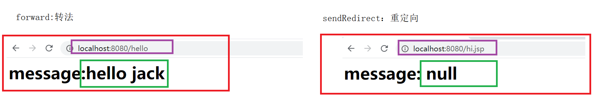
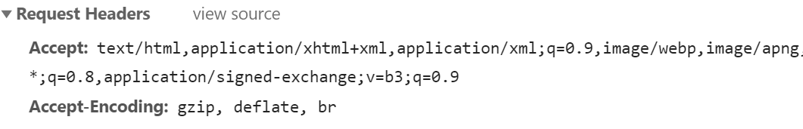
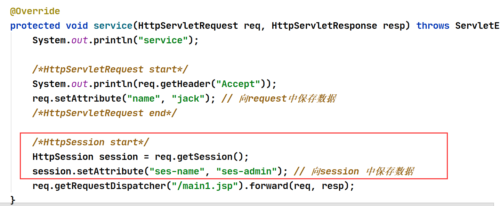

# 回归

1. Servlet环境部署
   1. 构建maven工程
   2. 配置pom.xml、添加依赖
   3. 服务端代码：编写一个类 继承 HttpServlet
   4. 配置web.xml : url 映射
   5. 前端代码
2. Servlet如何获取客户端的请求参数： request.getParameter("字符串")；
3. 如何返回视图： request.getRequestDispatcher("路径").forword(request,response);
4. 服务器端如何返回数据给客户端：服务器 setAttribute();   客户端使用 getAttribute();
5. GET&POST的区别: get 用于查询、数据量小、不安全。post主要发送数据（注册）、安全、数量大

# Servlet的生命周期

指的是 Servlet 的创建 运行 销毁的过程。

```java
package com.iweb.servlet;

import javax.servlet.ServletConfig;
import javax.servlet.ServletException;
import javax.servlet.annotation.WebInitParam;
import javax.servlet.annotation.WebServlet;
import javax.servlet.http.HttpServlet;
import javax.servlet.http.HttpServletRequest;
import javax.servlet.http.HttpServletResponse;
import java.io.IOException;

/**
 * 作者: jack
 * 时间: 2021-05-28 0028 08:48
 * 描述: UserServlet
 */
@WebServlet(value = "/hi", loadOnStartup = 1, initParams = {
        @WebInitParam(name = "username", value = "scott"),
        @WebInitParam(name = "password", value = "123456")
}) // http://localhost:8080/hi
public class UserServlet extends HttpServlet {


    /**
     * 用户第一次请求的时候执行,只会执行一次, 优先于 init()
     * 通过设置 loadOnStartup = 1 来使得服务器启动的时候 执行 init()
     *
     * @param config : ServletConfig 的 实例在服务器启动的时候获取用户配置的参数 @WebInitParam
     * @throws ServletException
     */
    @Override
    public void init(ServletConfig config) throws ServletException {
        System.out.println("init(ServletConfig config)");
        String username = config.getInitParameter("username");
        String password = config.getInitParameter("password");
        System.out.println(username + "\t" + password);
    }

    /**
     * 初始化：
     * 用户第一次请求的时候执行,只会执行一次
     * 通过设置 loadOnStartup = 1 来使得服务器启动的时候 执行 init()
     *
     * @throws ServletException
     */
    @Override
    public void init() throws ServletException {
        System.out.println("init ...");
    }

    /**
     * 用户发起 GET 请求的时候执行, 用来处理 GET 请求
     *
     * @param req
     * @param resp
     * @throws ServletException
     * @throws IOException
     */
    @Override
    protected void doGet(HttpServletRequest req, HttpServletResponse resp) throws ServletException, IOException {
        System.out.println("do Get ...");
        req.getRequestDispatcher("/main.jsp").forward(req, resp);
    }

    /**
     * 用来处理 POST 请求
     *
     * @param req
     * @param resp
     * @throws ServletException
     * @throws IOException
     */
    @Override
    protected void doPost(HttpServletRequest req, HttpServletResponse resp) throws ServletException, IOException {
        System.out.println("do Post ...");
        req.getRequestDispatcher("/main.jsp").forward(req, resp);
    }

    /**
     * 停止 服务器的时候销毁
     */
    @Override
    public void destroy() {
        System.out.println("destroy ...");
    }
}
```

总结：（记住，背诵）

1. init(ServletConfig config)：用户第一次请求的时候执行,只会执行一次, 优先于 init()，通过设置 loadOnStartup = 1 来使得服务器启动的时候 执行 init()
2. init() ：用户第一次请求的时候执行,只会执行一次，通过设置 loadOnStartup = 1 来使得服务器启动的时候 执行 init()
3. doGet()，doPost() : doGet 处理get请求，doPost处理post请求，每次请求都会执行。
4. destroy()：服务器关闭的时候执行


# Servlet和jsp和tomcat的关系、区别（背诵+理解）

Servlet： 基于j2ee标准的开发工具包，<font color=red>这里的Servlet指的是服务器开发环境，保存了执行业务时所创建的servlet对象。</font>

jsp：java server page，本质上来说他还是一个 Servlet，和Servlet的区别在于 jsp 的主要功能是数据显示，而servlet的主要功能是处理用户请求。<font color=red>这里的Servlet指的是 HttpServlet的实例，也就是自己创建的那个servlet类</font>

tomcat： Servlet 容器，是servlet 程序的运行环境，tomcat中集成了 servlet。还有一些其他的servlet容器：jboss、weblogic...


# 转发和重定向（面试重点）

实验环境：

编写2个servlet ： HelloServlet  (/hello)、HiServlet (/hi)

从index.jsp发起请求：

http://localhost:8080/hello  => HelloServlet(设定返回数据name=hello jack)  => hello.jsp  显示name的值

http://localhost:8080/hi  => HiServlet(设定返回数据name=hi jack)  => hi.jsp 显示name的值

区别： hello 使用 forword  而 hi 使用 sendRedirect



说明： 图1获取到了服务器的数据，请求地址没有发生改变。图2没有获取到服务器的数据，请求地址发生了改变


转发：forword()  持有的是同一个request对象，只发起一次请求。主要用于请求数据

重定向：sendRedirect() 持有的不是同一个request对象，会发起2次请求，让用户重新去请求另外一个视图路径。 一些广而告之的信息。 服务器维护的时候可以重定向到一个 维护页面，重新发起请求。


helloservlet

```java
@WebServlet("/hello")
public class HelloServlet extends HttpServlet {
    @Override
    protected void service(HttpServletRequest req, HttpServletResponse resp) throws ServletException, IOException {
        req.setAttribute("name", "hello jack");
        req.getRequestDispatcher("/hello.jsp").forward(req, resp);
    }
}
```

hiservlet

```java
@WebServlet("/hi")
public class HiServlet extends HttpServlet {

    @Override
    protected void service(HttpServletRequest req, HttpServletResponse resp) throws ServletException, IOException {
        req.setAttribute("name", "hi jack");
        resp.sendRedirect("/hi.jsp");
    }
}
```


index.jsp

```html
<a href="/hello">hello</a>|<a href="/hi">hi</a>
```

hello.jsp

```jsp
<h1>
    message:<%=request.getAttribute("name")%>
</h1>
```

hi.jsp

```jsp
<h1>
    message: <%=request.getAttribute("name")%>
</h1>
```


# Servlet的常用对象

## HttpServletRequest（请求）

作用： 用来处理用户请求（Http的请求头），只能是一次连续的请求，他的生命周期只是一次请求。



服务器代码

```java
@WebServlet("/hello")
public class HelloServlet extends HttpServlet {

    @Override
    protected void service(HttpServletRequest req, HttpServletResponse resp) throws ServletException, IOException {
        System.out.println("service");
        System.out.println(req.getHeader("Accept"));
        req.setAttribute("name", "jack");
        req.getRequestDispatcher("/main1.jsp").forward(req, resp);
    }
}
```


jsp

```jsp
<%@ page contentType="text/html;charset=UTF-8" language="java" isELIgnored="false" %>
<html>
<head>
    <title>Title</title>
</head>
<body>

name:<%=request.getAttribute("name")%>

</body>
</html>
```

测试：

1. 第一次请求 http://localhost:8080/hello
2. 第二次请求 http://localhost:8080/main1.jsp

第一次请求可以获取 服务器端的数据，而第二请求返回的和第一次是同一个视图路径。但是第二次请求没有数据


## HttpSession（会话）

作用： 保存的是一次会话的数据（一个浏览器客户端）。

如何获取： req.getSession(); 

保存数据：session.setAttribute("ses-name", "ses-admin"); 


修改上面的 service 代码 



测试

1. 第一次请求 http://localhost:8080/hello   可以同时获取 request 和session 的数据
2. 第二次请求 http://localhost:8080/main1.jsp  只能看到 session数据
3. 换一个浏览器访问 http://localhost:8080/main1.jsp request和session的数据都看不见

## ServletContext（上下文）

有叫做： application  作用是全局的 。 全服务器共享的数据，意味着向 application 中设定的数据 整个服务器都可以访问。

获取 application的方法 ：request.getServletContext();

