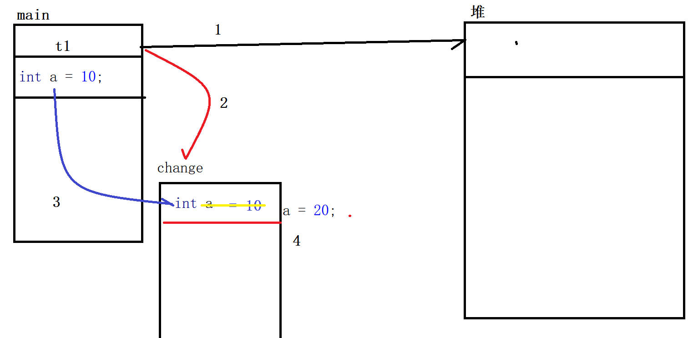

# 方法

```java
/**
 * 作者: jack
 * 时间: 2021-04-19 0019 08:46
 * 描述: Test
 * <p>
 * 方法
 * [访问修饰符] 返回值类型 方法名([参数列表]){
 * // 方法体
 * return [返回值]
 * }
 * 访问修饰符： 现阶段我们都使用 public (不写-缺省的、private、protected)
 * 返回值类型： void-表示没有返回值、 任意的数据类型-基本数据类型、引用数据(String、数组、自定义的java类型)
 * 方法名： 方法名需要遵循变量的命名规则
 * 参数列表： 理论上不限制类型和个数。 约定上 不超过3个
 * 方法体：业务代码
 * 返回值： 和 返回值类型 相关(指定数据类型的字面量、变量、表达式), 如果是void 则不需要返回值。
 */
public class Test {

    public void show(int a, String str) {
        System.out.printf("(int %s, String %s) \n", a, str);
    }

    public double sum(double a, double b) {
        // return 10.0D; // 返回的是字面量
        double res = a + b;
        // return res; // 返回变量
        return a + b; // 表达式
    }

    // 多参数列表, 必须是形参的最后一个
    public int[] createArr(String str, int... num) {  // >=0     实参传递 ：  1,2,3,4
        return num; // num 在运行的过程中看作是一个数组
    }

    public int[] createArr1(int[] num) {  // 数组    实参: 要先创建一个数组  new int[len]
        return num;
    }

    public static void main(String[] args) {
        Test t = new Test(); // new 是开辟堆内存空间
        t.show(100, "iweb");

        double res = t.sum(10.0D, 20); // ????  // 20 int - > double
        System.out.println(res);

        int[] arr = t.createArr("arr", 1, 2, 3, 4);
        System.out.println(Arrays.toString(arr));
    }

}
```


# 变量的作用域

变量的作用域： 声明这个变量的花括号。

```java
/**
 * 作者: jack
 * 时间: 2021-04-19 0019 09:08
 * 描述: Test
 * 变量的作用域
 * 注意同名变量的问题：
 * 1. 在同一个作用域(同一对 花括号)  不能有同名变量
 * 2. 就近原则
 */
public class Test {

    int a = 100; // 成员变量、实例变量: 类中、方法外

    public void show(int num) { // 相当于 局部变量
        System.out.println(a); // 引用变量 a
        int b = 200; // 局部变量
        {
            // 代码块
            int c = 300;
        }
        System.out.println(b);
        // System.out.println(c);
        System.out.println(num);

        int a = 400; // 和成员变量同名
        System.out.println(a); // 就近原则
    }

    public static void main(String[] args) {
        Test test = new Test();
        test.show(1000);
    }

}
```

# 消息-参数的传递

## 基本数据类型

```JAVA
/**
 * 作者: jack
 * 时间: 2021-04-19 0019 09:18
 * 描述: Test1
 */
public class Test1 {

    public void change(int a) { //  a = a ; ->  a = 10;
        System.out.println("before:" + a);
        a = 20; // 改变a的值
        System.out.println("after:" + a);
    }

    public static void main(String[] args) {
        Test1 t1 = new Test1();

        int a = 10;
        t1.change(a); // 传递的是字面量
        System.out.println(a); //  10

    }

}
```

****

## **引用数据类型**

**数组**

```java
public class Test2 {

    public void changeArr(int[] arr) {
        System.out.println("before:" + Arrays.toString(arr));
        arr[0] = 10;
        System.out.println("after:" + Arrays.toString(arr));

    }


    public static void main(String[] args) {

        Test2 t2 = new Test2();

        int[] arr = {1, 2, 3};

        t2.changeArr(arr);
        System.out.println(Arrays.toString(arr)); // 数组的元素被 change 改变了
    }
}
```


## **String**

特殊的引用数据类型：可以像基本数据类型一样通过字面量直接初始化，保存在栈


## **对象类型**


# 选择排序

在待排的数组中选择一个大（小）的放到待排数组的头部（尾部）。


```java
package com.iweb.lesson04;

import java.util.Arrays;

/**
 * 作者: jack
 * 时间: 2021-04-19 0019 11:18
 * 描述: SelectSort
 * 稳定性： 待排数组中 2个相同数据排序后和排序前的位置不变这就是稳定的,可能发生改变那就是不稳定的
 * 冒泡： 稳定的
 * 选择：不稳定的 5 8 5 2 9
 */
public class SelectSort {

    String name = "jack";

    public void sort(int[] arr) {
        // 选择多少次
        for (int i = 0; i < arr.length - 1; i++) { // i 待排数组的头部
            int min = arr[i];
            int pos = i;
            // 找到最小数 min 和 最小数 的位置 pos
            for (int j = i + 1; j <= arr.length - 1; j++) {
                if (min > arr[j]) {
                    min = arr[j];
                    pos = j;
                }
            }
            // 将最小数和  i 位置的数进行交换
            if (pos == i) continue;
            arr[pos] = arr[i];
            arr[i] = min;
        }

    }

    public static void main(String[] args) {

        // 5 8 5 2 9  : 不稳定
        int[] arr = {11, 11, 23, 98, 71, 49, 63, 12, 31, 12};
        SelectSort sort = new SelectSort();
        sort.sort(arr);
        System.out.println(Arrays.toString(arr));
    }

}
```


# 构造函数

又叫做构造器、构造方法。我们可以通过构造函数来创建对象。当我们去声明一个类的时候, 这个类就有一个默认的构造函数。

```java
/**
 * 作者: jack
 * 时间: 2021-04-19 0019 13:38
 * 描述: Student
 */
public class Student {

    String name;
    int age;

    public Student() {
        // 默认的构造函数： 无参的
        System.out.println("student");
    }

    public void show() {
        System.out.println(name + "\t" + age);
    }

}
```

测试：当创建对象的时候会自动调用 无参的构造函数

```java
public class Test {

    public static void main(String[] args) {
        Student student = new Student(); // 创建对象： 调用了构造函数  Student()
    }
}
```


## 构造函数的特征

1. 构造函数的函数名和类名必须是相同的
2. 构造函数没有返回值类型
3. 构造函数是通过 new 关键字来调用
4. 构造函数的作用是创建对象： 申请堆内存空间

PS： 一个类中可以有多个构造函数,看下面

## 构造函数重载

一个类可以有多个构造函数，多个构造函数之间拥有不同的参数列表(参数的个数、顺序、类型)

```java
package com.iweb.lesson06;

/**
 * 作者: jack
 * 时间: 2021-04-19 0019 13:45
 * 描述: Student
 */
public class Student {


    String name;
    int age;

    public Student() {
        System.out.println("Student()");
    }

    public Student(String name) {
        System.out.println("Student(String name) :" + name);
    }

    public Student(int age) {
        System.out.println("Student(int age) :" + age);
    }

    public Student(String name, int age) {
        System.out.println("Student(String name, int age) :" + name + "\t" + age);
    }

    public Student(int age, String name) {
        System.out.println("Student(int age, String name) :" + age + "\t" + name);
    }

}

```


**错误的例子**： 只是变量名称不同


## 如何调用构造函数重载

多个构造函数重载： 由调用的参数列表来决定调用哪个构造函数重载


# 构造函数重载的作用、应用

可以通过构造函数重载实现对成员变量进行初始化

```java
public class Student {


    String name; // field
    int age;

    // method
    public Student() {
        System.out.println("Student()");
    }

    public Student(String name_) {
        System.out.println("Student(String name) :" + name_);
        name = name_;
    }

    public Student(int age_) {
        System.out.println("Student(int age) :" + age_);
        age = age_;
    }

    public Student(String name_, int age_) {
        System.out.println("Student(String name, int age) :" + name_ + "\t" + age_);
        name = name_;
        age = age_;
    }

    public Student(int age_, String name_) {
        System.out.println("Student(int age, String name) :" + age_ + "\t" + name_);
        age = age_;
        name = name_;
    }

}
```

```java
package com.iweb.lesson06;

/**
 * 作者: jack
 * 时间: 2021-04-19 0019 13:56
 * 描述: Test
 */
public class Test {

    public static void main(String[] args) {
        

        // 使用构造函数进行属性初始化

        // 以前的做法
//        Student student = new Student();
//        student.name = "jack";
//        student.age = 20;

        // 使用构造函数重载的做法 : 根据需要初始化的属性选择调用对应的构造函数重载

        Student s1 = new Student("jack");
        System.out.println(s1.name);

        Student s2 = new Student("jack", 20);
        System.out.println(s2.name + "\t" + s2.age);


    }

}
```

# this关键字

上面的代码为了避开同名变量的问题，特地使用了 _ 总感觉美中不足。

this代表当前对象：

1. 创建的对象 （构造函数中）
2. 调用方法的对象 （普通方法中）

```java
package com.iweb.lesson07;

/**
 * 作者: jack
 * 时间: 2021-04-19 0019 14:17
 * 描述: Student
 */
public class Student {

    String name;
    int age;

    public Student() {
        System.out.println("Student()");
    }

    public Student(String name) {
        System.out.println("Student(String name) :" + name);
        // name = name; // 同名变量问题
        this.name = name; // this = 创建的那个对象
    }

    public Student(int age) {
        System.out.println("Student(int age) :" + age);
        this.age = age;
    }

    public Student(String name, int age) {
        System.out.println("Student(String name, int age) :" + name + "\t" + age);
        this.name = name;
        this.age = age;
    }

    public Student(int age, String name) {
        System.out.println("Student(int age, String name) :" + age + "\t" + name);
        this.age = age;
        this.name = name;
    }

    public void show() {
        System.out.println(this.name + "\t" + this.age);
    }
}
```

```java
package com.iweb.lesson07;

/**
 * 作者: jack
 * 时间: 2021-04-19 0019 14:20
 * 描述: Test
 */
public class Test {
    public static void main(String[] args) {

        Student s1 = new Student("jack", 20);
        Student s2 = new Student("tom", 21);

        System.out.println(s1.name);// jack
        System.out.println(s2.name);// tom

        s1.show();
        s2.show();

    }
}
```

# 匿名对象

```java
package com.iweb.lesson08;

/**
 * 作者: jack
 * 时间: 2021-04-19 0019 14:24
 * 描述: Test
 */
public class Test {
    public static void main(String[] args) {

        Student student = new Student();
        student.show();
        // 将 student 声明出来的意义在于可能后面的代码还需要用到 student


        int a = 10;
        int b = 20;
        int c = 30;

        // (10 + 20)   (20 + 30)  (20 + 20) : 变量的好处 复用性

        // 如果只是用一次可以使用匿名对象
        new Student().show();
        // new Student().show(); // new 必定申请新的堆内存空间， 新的对象

    }
}
```

# 方法重载

一个类中，方法名相同、参数列表不同、和返回值无关（返回值类型不同不能形成方法重载）。 

由参数列表来决定调用是哪个重载的方法。

```java
package com.iweb.lesson09;

/**
 * 作者: jack
 * 时间: 2021-04-19 0019 16:01
 * 描述: Student
 */
public class Student {


    public void show() {
        System.out.println("show()");
    }

    // 和返回值无关
//    public int show() {
//        System.out.println("show()");
//        return 0;
//    }


    public void show(String str) {
        System.out.println("show(String str)");
    }

    public void show(int number) {
        System.out.println("show(int number)");
    }

    public void show(String str, int number) {
        System.out.println("show(String str, int number)");
    }

    public void show(int number, String str) {
        System.out.println("show(int number, String str)");
    }


}
```

```java
package com.iweb.lesson09;

/**
 * 作者: jack
 * 时间: 2021-04-19 0019 16:04
 * 描述: Test
 */
public class Test {

    public static void main(String[] args) {

        Student student = new Student();

        // 由参数列表来决定调用哪个重载的方法
        student.show("str", 100);

    }
}
```


# 构造函数补充说明

如果一个类中存在了构造函数重载，那么缺省的无参的构造函数就不存在了。

```java
/**
 * 作者: jack
 * 时间: 2021-04-19 0019 16:07
 * 描述: Student
 */
public class Student {

    // 构造函数重载的情况下如果需要使用则需要显示的声明出来
    public Student() {

    }

    public Student(String name) {

    }


    public static void main(String[] args) {
        Student student = new Student();
    }
}
```


# 方法重载的应用

实现一个除法计算： int  double

int的除法计算在java中 是抹去小数位。double是保留小数位。 都是除法但是计算的结果和规则不同。

```java
package com.iweb.lesson11;

/**
 * 作者: jack
 * 时间: 2021-04-19 0019 16:11
 * 描述: Test
 */
public class Test {


    public int divide(int a, int b) {
        if (b == 0) {
            System.out.println("除数不能为0");
            return 0;
        }
        return a / b;
    }

    public double divide(double a, double b) {
        if (b == 0) {
            System.out.println("除数不能为0");
            return 0.0D;
        }
        return a / b;
    }

    public static void main(String[] args) {
        Test test = new Test();
        // 对应调用者而言只是调用一个方法, 而有JVM去判断调用了哪个方法重载
        int res1 = test.divide(10, 2);
        double res2 = test.divide(10.0D, 2.0D);
        System.out.println(res1);
        System.out.println(res2);
    }

}
```


在上面的方法上面进行改造

```java
public long divide(long a, long b) {
    if (b == 0) {
        System.out.println("除数不能为0");
        return 0;
    }
    return a / b;
}

public short divide(short a, short b) {
    if (b == 0) {
        System.out.println("除数不能为0");
        return 0;
    }
    return (short) (a / b); // 整型计算结果默认是 int
}
```


```java
public static void main(String[] args) {
    Test test = new Test();
    // 对应调用者而言只是调用一个方法, 而有JVM去判断调用了哪个方法重载
    short a = 10;
    short b = 5;
    test.divide(a, b); // JVM会判定调用哪个方法重载
}
```


错误实例

```java
/**
 * 作者: jack
 * 时间: 2021-04-19 0019 16:23
 * 描述: Test
 */
public class Test {


    public void show(String str) {
        System.out.println("str");
    }

    public void show(int[] arr) {
        System.out.println("arr");
    }

    public static void main(String[] args) {
        Test test = new Test();
        // test.show(null);  // 这里报错
    }

}
```


