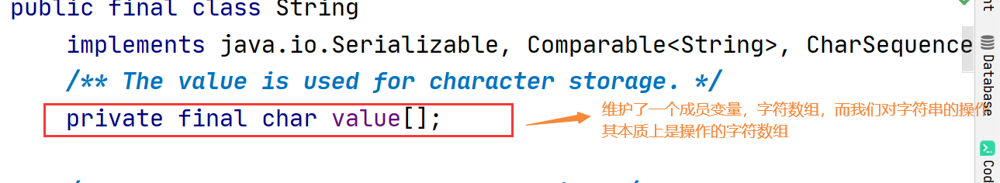
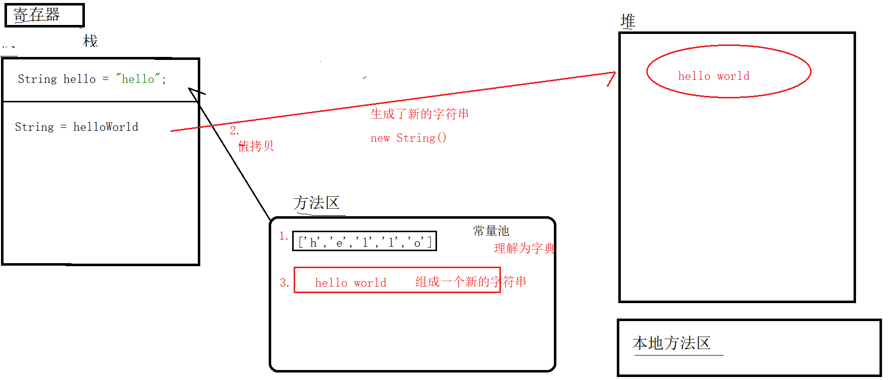
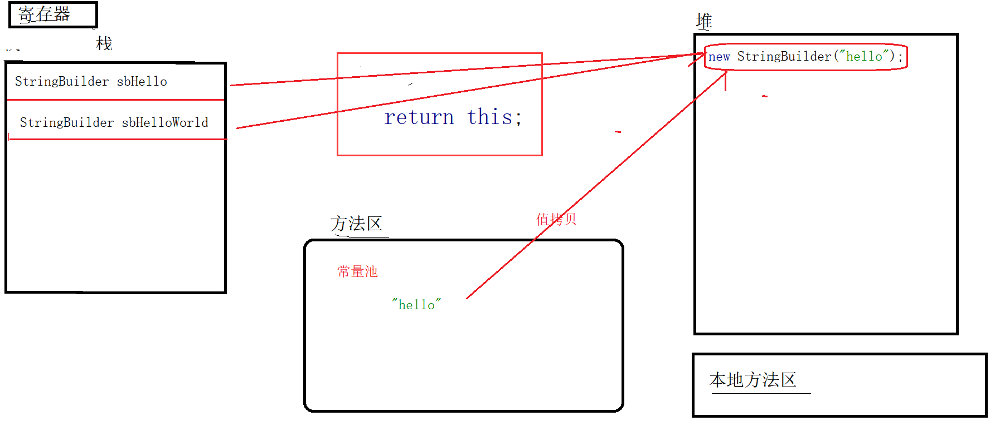
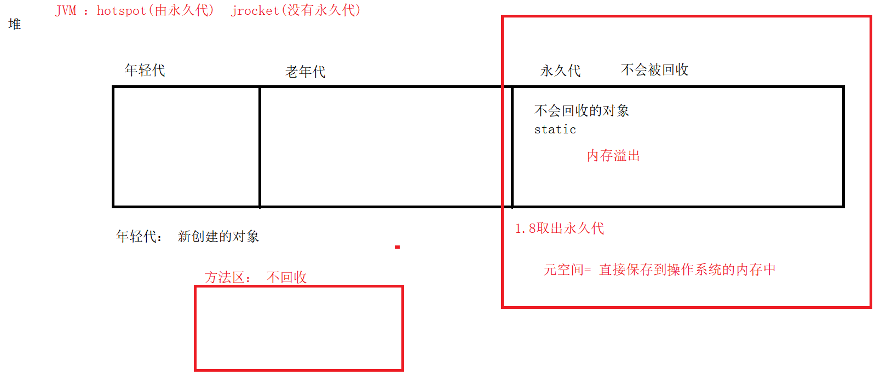

# 1.String&StringBuffer&StringBuilder

字符串： 一组字符的有序排列。

String: 固定长度字符串

StringBuffer&StringBuilder： 可变长度字符串


## 1.1 String




### 1.1.1 创建字符串的方式

```java
public class Test {
    public static void main(String[] args) {

        String str1 = "abc";// 字面量的方式直接进行赋值

        // 通过构造函数
        // String(String original)
        String str2 = new String("abc");

        // public String(char value[])
        String str3 = new String(new char[]{'a', 'b', 'c'});

        // public String(byte bytes[], Charset charset)
        String str4 = new String(new byte[]{97, 98, 99}, Charset.forName("UTF-8"));

        // 字符串的比较
        System.out.println(str1.equals(str2));
        System.out.println(str2.equals(str3));
        System.out.println(str3.equals(str4));


    }
}
```


### 1.1.2== 和 equals的区别

```java
String str1 = "abc"; // 存储位置是栈空间
String str2 = new String("abc"); // new 的方式, 存储位置是 堆空间
String str3 = "abc";
String str4 = new String("abc");

System.out.println(str1 == str3); // abc和abc值进行比较  == true
System.out.println(str2 == str4); // 栈保存的是内存地址, 比较的是内存地址  == false
System.out.println(str1 == str2); // false  abc值和内存地址进行比较

// 字符串的比较推荐是 equals()
System.out.println(str1.equals(str2)); // true
```


### 1.1.3String的固定长度的理解

```java
String hello = "hello";
// 产生了一个新的字符串
String helloWorld = hello.concat(" word"); // 连接字符串 其效果相当于  hello + " word"
System.out.println(hello); // 固定长度字符串
System.out.println(helloWorld);

StringBuilder sbHello = new StringBuilder("hello");
// 返回的字符串和 原来的字符串是同一个对象
StringBuilder sbHelloWorld = sbHello.append(" world");
System.out.println(sbHello); // hello world  可变长度字符串
System.out.println(sbHelloWorld); // hello world
System.out.println(sbHello == sbHelloWorld); // true
```

从内存的划分上面来看

固定长度： 返回的String 都会 new 一个新的字符串



可变长度： 返回时原来的对象




### 1.1.4常量池的理解

常量池中保存是的一些基本字符 常用的常量（1，2，3，4 .... a,b,c.... 特殊符号）。字符串也存在于常量池，每个新的字符串都会保存在常量池中，再次使用的时候首先会从常量池中获取，如果没有则生成一个新的字符串，并加入池中。

```java
public static void main(String[] args) {

    String str = "a";
    for (int i = 0; i < 10000; i++) {
        str += str;
        str.intern(); // 将字符串加入到常量池
        // 池的大小不够的时候会溢出
        // java.lang.OutOfMemoryError: Java heap space
    }

}
```

Jdk1.6及之前：有永久代，常量池1.6在方法区

Jdk1.7：有永久代，但已经逐步“去永久代”，常量池1.7在堆

Jdk1.8及之后：无永久代，常量池1.8在元空间

了解一下 (GFirtst 1.8之后的垃圾收集器)



### 1.1.5String和StringBuffer和StringBuilder性能比较

```java
// String的性能
String str = "a";
long start = System.currentTimeMillis();
for (int i = 0; i < 100000; i++) {
    str += "a";
}
long end = System.currentTimeMillis();
System.out.println(end - start); // 5041

// StringBuilder
StringBuilder sb = new StringBuilder("a");
start = System.currentTimeMillis();
for (int i = 0; i < 100000; i++) {
    sb.append("a");
}
end = System.currentTimeMillis();
System.out.println(end - start); // 1

System.out.println(str.equals(sb.toString())); // 不能写 sb 要是 sb.toString()
```


结论：

StringBuffer、StringBuilder 的效率要高于String, 对于大量的字符串拼接的操作我们推荐使用 StringBuilder ，而小量的则使用 String 比较方便。

StringBuffer和 StringBuilder，StringBuilder是JDK1.5之后用来替代 StringBuffer 的API。 区别在于 StringBuffer所有的方法都是同步的(线程安全)，StringBuilder是不同步的。

### 1.1.6String的常用API

练习 参照笔记


# 2.System

```java
System.gc(); // 提示进行垃圾回收操作
System.currentTimeMillis(); // 系统当前时间戳  毫秒数
System.out.println("abc");// 输出到控制
// Scanner scanner = new Scanner(System.in); // 输入
String javaHome = System.getenv("JAVA_HOME");// 获取系统环境变量
System.out.println(javaHome);
System.out.println(System.getenv("username"));
```


# 3.Math   

函数类、数学类

```java
// Math 所有的方法都是 static
System.out.println(Math.random());
System.out.println(Math.round(9.8));// 四舍五入
System.out.println(Math.ceil(9.1)); // 向上取整
System.out.println(Math.floor(9.8));// 向下取整
```

# 4.Random

```java
Random random = new Random();

System.out.println(random.nextInt()); // 随机的整型数据
System.out.println(random.nextInt(10)); // 0-9
System.out.println(random.nextDouble()); // 0-1
```

# 5.Date

```java
// Date
Date date = new Date(); // 系统当前时间
System.out.println(date);
// 时间格式化   HH = 24  hh=12
SimpleDateFormat sdf = new SimpleDateFormat("yyyy-MM-dd HH:mm:ss");
System.out.println(sdf.format(date));// 2021-04-26 11:53:20

// 将字符串转出 Date
String dateStr = "2021-04-25 11:53:20";
Date time = sdf.parse(dateStr);
System.out.println(time);

// Date -> long
System.out.println(time.getTime());
```

日期的计算（日历）

```java
Date now = new Date();

// 创建日历对象
Calendar calendar = Calendar.getInstance();

// 设定日历的基准时间
calendar.setTime(now);

// 时间的操作
calendar.add(Calendar.MONTH, -1); // 把日历向前翻了一个月

System.out.println(calendar.getTime());
```

