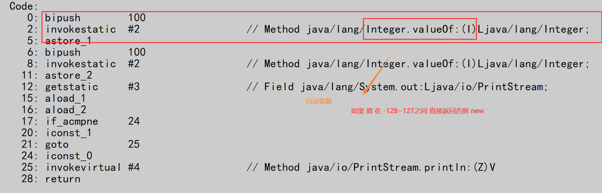
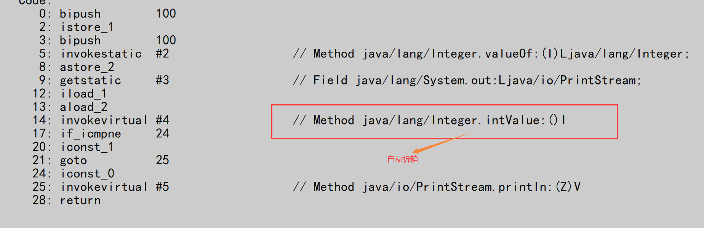
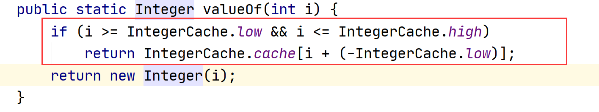
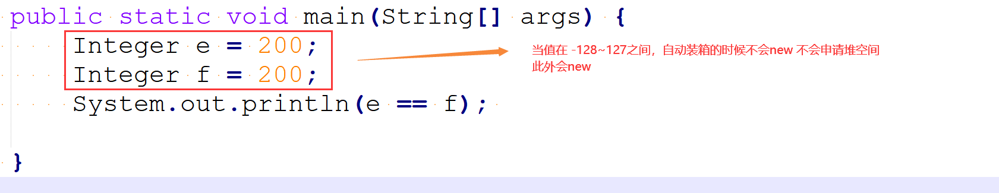
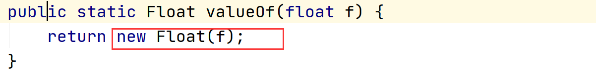

# 包装类

什么是包装类：每个基本数据类型都对应着一个包装类。

byte -> Byte

short -> Short

int -> Integer

long -> Long

float -> Float

double -> Double

boolean -> Boolean

char -> Character


包装类的本质：维护了一个对应类型的成员变量，提供了对当前数据类型的操作方法。


包装类和基本数据类型的区别：（面试）

基本数据类型主要用于运算，计算，而包装类提供了对于当前类的操作方法。基本数据类型没有操作方法。

## 整数类型

```java
public class Test {

    public static void main(String[] args) {

        // 整型 int
        int a = 100;
        int b = 100;

        System.out.println(a == b); // true 基本数据类型

        Integer c = new Integer(100); // class
        Integer d = new Integer(100);
        System.out.println(c == d); // false

        // JDK5 之后提供自动装箱 自动拆箱的机制
        Integer e = 100; // 自动装箱(JVM会帮助我们去创建对象 Integer.valueOf)： 目的就是简化代码 ， 还可以进行方法调用

        /*
        Integer e = Integer.valueOf(100);
         */

        Integer f = 100;

        /**
         * int x = e.intValue();
         * a == e
         */
        System.out.println(a == e); // 1. 类型匹配 2. Integer -> int  自动拆箱

        // 什么时候会自动拆箱：
        // 1. 当包装类型和基本数据类型进行比较的时候
        // 2. 当使用包装类型进行 + - * / 等计算的时候


    }

}
```

自动装箱




自动拆箱





注意



## 浮点类型

```java
float a = 100.0F;
float b = 100.0F;

System.out.println(a == b);// true

Float c = 100.0F;
Float d = 100.0F;

System.out.println(a == c); // true
System.out.println(c == d);// false
```



