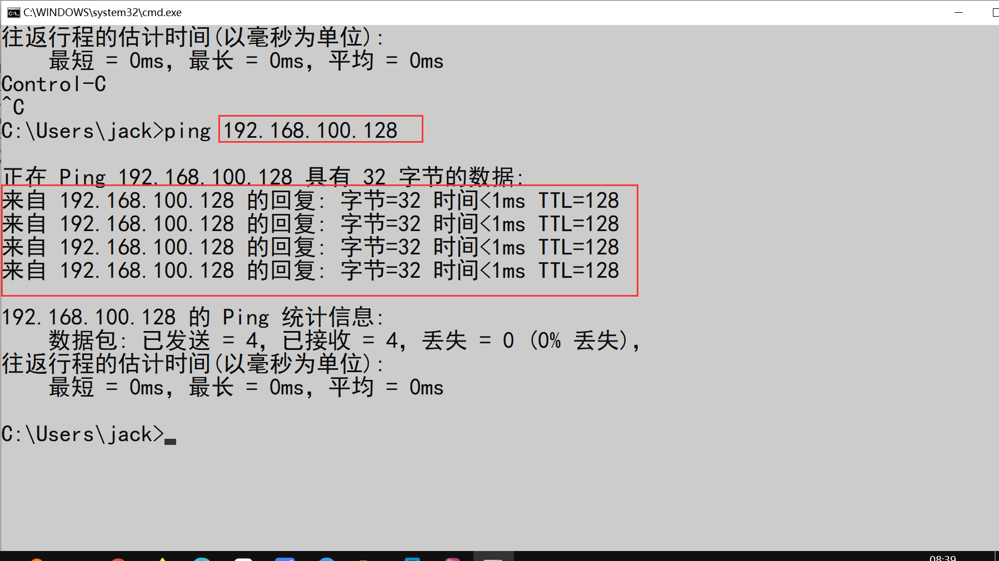

# JDBC

## 准备工作

查看虚拟机的IP地址


确认网络是否可用




网络不通的解决办法

第一步


第二步： 如果不在同一个网段


第三步

关闭虚拟主机，还原网络设置


还原后网段会重新分配。


再重新确认步骤。


## 确认数据库是否能够远程客户端操作

确认虚机中数据库的安装路径 ： C:\oracle\product\10.2.0\db_1\NETWORK\ADMIN

**tnsnames.ora**  修改 HOST = 你的虚机IP

```
# tnsnames.ora Network Configuration File: C:\oracle\product\10.2.0\db_1\network\admin\tnsnames.ora
# Generated by Oracle configuration tools.

ORCL =
  (DESCRIPTION =
    (ADDRESS_LIST =
      (ADDRESS = (PROTOCOL = TCP)(HOST = 192.168.100.128)(PORT = 1521))
    )
    (CONNECT_DATA =
      (SERVER = DEDICATED)
      (SERVICE_NAME = orcl)
    )
  )

EXTPROC_CONNECTION_DATA =
  (DESCRIPTION =
    (ADDRESS_LIST =
      (ADDRESS = (PROTOCOL = IPC)(KEY = EXTPROC1))
    )
    (CONNECT_DATA =
      (SID = PLSExtProc)
      (PRESENTATION = RO)
    )
  )


```


**listener.ora**：修改 HOST = 你的IP

```
# listener.ora Network Configuration File: C:\oracle\product\10.2.0\db_1\network\admin\listener.ora
# Generated by Oracle configuration tools.

SID_LIST_LISTENER =
  (SID_LIST =
    (SID_DESC =
      (SID_NAME = PLSExtProc)
      (ORACLE_HOME = C:\oracle\product\10.2.0\db_1)
      (PROGRAM = extproc)
    )
  )

LISTENER =
  (DESCRIPTION_LIST =
    (DESCRIPTION =
      (ADDRESS = (PROTOCOL = IPC)(KEY = EXTPROC1))
      (ADDRESS = (PROTOCOL = TCP)(HOST = 192.168.100.128)(PORT = 1521))
    )
  )

```


在服务重启OracleServiceORCL    OracleOraDb10g_home1TNSListener


连接数据库


查看用户


开启用户： 1. 解锁 2.设置密码


测试远程登录


# 使用java连接数据库

1. 引用jar包 ： ojdbc14.jar
2. 编写连接数据库代码


```java
public class Test {


    public static void main(String[] args) throws Exception {


        /*
        1. 加载驱动  ojdbc14.jar 中
        2. 连接数据库获取会话
         */

        // 数据库连接的 4 个基本参数：url(proto.IP:PORT)  user pwd driver
        String user = "scott";
        String pwd = "123456";
        //  oracle.jdbc.OracleDriver  11g以上版本   oracle.jdbc.driver.OracleDriver 11g一下
        String driver = "oracle.jdbc.OracleDriver"; // OracleDriver(记住)
        // jdbc:mysql
        String url = "jdbc:oracle:thin:@192.168.100.128:1521:orcl"; // conn scott/123456@orcl

        Connection conn = null; // 数据库会话
        try {
            // 核心代码
            Class.forName(driver); // 加载驱动
            conn = DriverManager.getConnection(url, user, pwd); // 获取会话
            // 测试
            System.out.println(conn);
        } catch (Exception e) {
            e.printStackTrace();
        } finally {
            // 关闭数据库
            if (conn != null && !conn.isClosed()) {
                conn.close();
            }
        }

    }

}
```

封装DBUtil

```java
public class DBUtil {

    private String user = "scott";
    private String pwd = "123456";
    private String driver = "oracle.jdbc.OracleDriver"; // OracleDriver(记住)
    private String url = "jdbc:oracle:thin:@192.168.100.128:1521:orcl"; // conn scott/123456@orcl

    private Connection conn;

    /**
     * 连接数据库
     *
     * @return
     */
    public Connection getConnection() throws Exception {
        Class.forName(driver); // 加载驱动
        conn = DriverManager.getConnection(url, user, pwd); // 获取会话
        return conn;
    }


    /**
     * 关闭数据库
     */
    public void close() throws Exception {
        if (conn != null && !conn.isClosed()) {
            conn.close();
        }
    }

}
```

简单查询

```java
public class Test {
    public static void main(String[] args) throws Exception {

        DBUtil util = new DBUtil();

        try {
            Connection conn = util.getConnection();

            String sql = "select * from emp";
            /**
             * 1. 发送语句
             * 2. 发送执行指令
             * 3. 接收返回结果集
             */
            Statement st = conn.createStatement(); // 这个实例可用发送语句
            ResultSet rs = st.executeQuery(sql); // 发送 并 查询 返回结果集

            // 遍历结果集
            while (rs.next()) {
                Integer empno = rs.getInt("EMPNO");
                String ename = rs.getString("ENAME");
                String job = rs.getString("JOB");
                Integer mgr = rs.getInt("mgr");
                Date hiredate = rs.getDate("HIREDATE");
                Double sal = rs.getDouble("SAL");
                Double comm = rs.getDouble("COMM");
                Integer deptno = rs.getInt("DEPTNO");
                System.out.println(empno + "\t" + ename + "\t" + sal + "\t" + hiredate);
            }

        } catch (Exception e) {
            e.printStackTrace();
        } finally {
            util.close();
        }

    }
}
```

封装结果集

1. 构建Emp的bean
2. 将emp实例保存到List中

```java
package com.iweb.lesson02;

import java.util.Date;

/**
 * 作者: jack
 * 时间: 2021-05-07 0007 09:54
 * 描述: Emp
 */
public class Emp {

    private Integer empno;
    private String ename;
    private String job;
    private Integer mgr;
    private Date hiredate;
    private Double sal;
    private Double comm;
    private Integer deptno;

    public Emp() {
    }

    public Emp(Integer empno, String ename, String job, Integer mgr, Date hiredate, Double sal, Double comm, Integer deptno) {
        this.empno = empno;
        this.ename = ename;
        this.job = job;
        this.mgr = mgr;
        this.hiredate = hiredate;
        this.sal = sal;
        this.comm = comm;
        this.deptno = deptno;
    }

    public Integer getEmpno() {
        return empno;
    }

    public void setEmpno(Integer empno) {
        this.empno = empno;
    }

    public String getEname() {
        return ename;
    }

    public void setEname(String ename) {
        this.ename = ename;
    }

    public String getJob() {
        return job;
    }

    public void setJob(String job) {
        this.job = job;
    }

    public Integer getMgr() {
        return mgr;
    }

    public void setMgr(Integer mgr) {
        this.mgr = mgr;
    }

    public Date getHiredate() {
        return hiredate;
    }

    public void setHiredate(Date hiredate) {
        this.hiredate = hiredate;
    }

    public Double getSal() {
        return sal;
    }

    public void setSal(Double sal) {
        this.sal = sal;
    }

    public Double getComm() {
        return comm;
    }

    public void setComm(Double comm) {
        this.comm = comm;
    }

    public Integer getDeptno() {
        return deptno;
    }

    public void setDeptno(Integer deptno) {
        this.deptno = deptno;
    }

    @Override
    public String toString() {
        return "Emp{" +
                "empno=" + empno +
                ", ename='" + ename + '\'' +
                ", job='" + job + '\'' +
                ", mgr=" + mgr +
                ", hiredate=" + hiredate +
                ", sal=" + sal +
                ", comm=" + comm +
                ", deptno=" + deptno +
                '}';
    }
}
```

修改Test的代码


封装表的操作类

```java
public class EmpDao {


    private DBUtil dbUtil;

    public EmpDao(DBUtil dbUtil) {
        this.dbUtil = dbUtil;
    }

    /**
     * 查询所有
     *
     * @return
     */
    public List<Emp> selectAll() {
        List<Emp> emps = new ArrayList<>();
        String sql = "select * from emp";
        try {
            Connection conn = dbUtil.getConnection();
            /**
             * 1. 发送语句
             * 2. 发送执行指令
             * 3. 接收返回结果集
             */
            Statement st = conn.createStatement(); // 这个实例可用发送语句
            ResultSet rs = st.executeQuery(sql); // 发送 并 查询 返回结果集
            // 遍历结果集
            while (rs.next()) {
                Emp emp = createEmp(rs);
                emps.add(emp);
            }
        } catch (Exception e) {
            e.printStackTrace();
        } finally {
            try {
                dbUtil.close();
            } catch (Exception e) {
                e.printStackTrace();
            }
        }
        return emps;
    }


    /**
     * 条件查询
     *
     * @param dno
     * @return
     */
    public List<Emp> selectAllByDeptno(int dno) {
        List<Emp> emps = new ArrayList<>();
        String sql = "select * from emp where deptno = " + dno;
        try {
            Connection conn = dbUtil.getConnection();
            /**
             * 1. 发送语句
             * 2. 发送执行指令
             * 3. 接收返回结果集
             */
            Statement st = conn.createStatement(); // 这个实例可用发送语句
            ResultSet rs = st.executeQuery(sql); // 发送 并 查询 返回结果集

            // 遍历结果集
            while (rs.next()) {
                Emp emp = createEmp(rs);
                emps.add(emp);
            }

        } catch (Exception e) {
            e.printStackTrace();
        } finally {
            try {
                dbUtil.close();
            } catch (Exception e) {
                e.printStackTrace();
            }
        }
        return emps;
    }


    /**
     * 推荐使用*****************
     * PreparedStatement: Statement的扩展可以执行预编译的查询,将查询分成2步
     * 1. 发送sql语句    sql = select * from emp where deptno = ?  and sal > ?   ||   ? (1,2,3,4....)
     * 2. 设置查询条件   根据 ? 的位置进行设置
     * 好处：安全
     */
    public List<Emp> selectAllByDeptnoSal(Emp emp) {
        String sql = "select * from emp where deptno = ?  and sal > ?";
        List<Emp> emps = new ArrayList<>();

        try {
            Connection conn = dbUtil.getConnection();
            PreparedStatement pst = conn.prepareStatement(sql);
            // 设置参数
            pst.setInt(1, emp.getDeptno());
            pst.setDouble(2, emp.getSal());

            ResultSet rs = pst.executeQuery();

            while (rs.next()) {
                Emp e = createEmp(rs);
                emps.add(e);
            }

        } catch (Exception e) {
            e.printStackTrace();
        } finally {
            try {
                dbUtil.close();
            } catch (Exception e) {
                e.printStackTrace();
            }
        }
        return emps;
    }

    public List<Emp> selectLikeEname(String name) {

        String sql = "select * from emp where ename like ?";
        List<Emp> emps = new ArrayList<>();

        try {
            Connection conn = dbUtil.getConnection();
            PreparedStatement pst = conn.prepareStatement(sql);
            pst.setString(1, name);

            ResultSet rs = pst.executeQuery();

            while (rs.next()) {
                Emp emp = createEmp(rs);
                emps.add(emp);
            }

        } catch (Exception e) {
            e.printStackTrace();
        } finally {
            try {
                dbUtil.close();
            } catch (Exception e) {
                e.printStackTrace();
            }
        }

        return emps;

    }

    /**
     * 主键查询
     *
     * @param eno
     * @return
     */
    public Emp selectById(int eno) {
        Emp emp = null;
        String sql = "select * from emp where empno = ?";

        try {
            Connection conn = dbUtil.getConnection();
            PreparedStatement pst = conn.prepareStatement(sql);
            pst.setInt(1, eno);
            ResultSet rs = pst.executeQuery();
            while (rs.next()) {
                emp = createEmp(rs);
            }
        } catch (Exception e) {
            e.printStackTrace();
        } finally {
            try {
                dbUtil.close();
            } catch (Exception e) {
                e.printStackTrace();
            }
        }

        return emp;

    }

    /**
     * @param current : 当前页
     * @param size    : 当前页的条数
     * @return
     */
    public List<Emp> selectPage(int current, int size) {

        List<Emp> emps = new ArrayList<>();

        // ? 1 : 开始条 startIndex  ? 2: 结束条 endIndex
        String sql = "select * from " +
                "(select a.*,rownum rn from " +
                "(select * from emp order by empno) a where rownum <= ? ) b where b.rn >?";

        // 由 （int current, int size） 计算得到 （startIndex，endIndex）
        int startIndex = (current - 1) * size;
        int endIndex = current * size;

        try {
            Connection conn = dbUtil.getConnection();
            PreparedStatement pst = conn.prepareStatement(sql);

            pst.setInt(1, endIndex);
            pst.setInt(2, startIndex);
            ResultSet rs = pst.executeQuery();
            while (rs.next()) {
                Emp emp = createEmp(rs);
                emps.add(emp);
            }
        } catch (Exception e) {
            e.printStackTrace();
        } finally {
            try {
                dbUtil.close();
            } catch (Exception e) {
                e.printStackTrace();
            }
        }

        return emps;
    }

    private Emp createEmp(ResultSet rs) throws SQLException {
        Integer empno = rs.getInt("EMPNO");
        String ename = rs.getString("ENAME");
        String job = rs.getString("JOB");
        Integer mgr = rs.getInt("mgr");
        Date hiredate = rs.getDate("HIREDATE");
        Double sal = rs.getDouble("SAL");
        Double comm = rs.getDouble("COMM");
        Integer deptno = rs.getInt("DEPTNO");
        return new Emp(empno, ename, job, mgr, hiredate, sal, comm, deptno);
    }
}
```

练习： 实现分页条件查询

```java
/**
条件是： 指定部门=?  工资>?
*/
public List<Emp> selectPageBySelective(Emp emp, int current, int size){
    // TO DO
}


```


