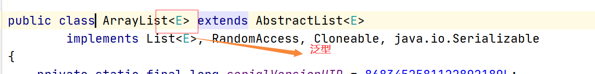

# 1.JavaBean

```java
/**
 * 作者: jack
 * 时间: 2021-04-27 0027 08:41
 * 描述: User
 * 类： 属性 、 方法(业务逻辑)
 * javabean: 一个简单的java对象, 类中不包含业务逻辑的方法。
 * 1. 属性私有
 * 2. 无参的构造函数
 * 3. 公共的set/get方法
 */
public class User {

    /*所有的属性必须私有化*/
    private Integer id;
    private String name;
    private Integer age;
    private Date birth;

    /*无参的构造函数 - 必须的*/
    public User() {

    }

    // 不是必须的
    public User(Integer id, String name, Integer age, Date birth) {
        this.id = id;
        this.name = name;
        this.age = age;
        this.birth = birth;
    }

    /*set/get方法 - 必须的*/
    public Integer getId() {
        return id;
    }

    public void setId(Integer id) {
        this.id = id;
    }

    public String getName() {
        return name;
    }

    public void setName(String name) {
        this.name = name;
    }

    public Integer getAge() {
        return age;
    }

    public void setAge(Integer age) {
        this.age = age;
    }

    public Date getBirth() {
        return birth;
    }

    public void setBirth(Date birth) {
        this.birth = birth;
    }
}
```

javabean的使用

```java
public class Test {
    public static void main(String[] args) throws Exception {

        SimpleDateFormat sdf = new SimpleDateFormat("yyyy-MM-dd");

        // 使用javabean
        // 保存一个用户的数据
        User user1 = new User();
        user1.setId(1);
        user1.setName("张三");
        user1.setAge(20);
        user1.setBirth(sdf.parse("1998-01-01"));

        User user2 = new User();
        user1.setId(2);
        user1.setName("小黑");
        user1.setAge(21);
        user1.setBirth(sdf.parse("1998-01-01"));
    }
}
```


# 2.ArrayList



泛型：

1. 只能是应用数据类型
2. 泛型是在使用的时候指定的数据类型，就是后引用的数据类型

```java
/**
 * 作者: jack
 * 时间: 2021-04-27 0027 09:49
 * 描述: ArrayListTest
 * 底层结构是数组 ：
 * 1. 容器的初始化容量是 10 , 如果容量不够的清空下 增长 50%
 * 2. 底层是数据, 增删比较慢, 查询比较快
 */
public class ArrayListTest {

    public static void main(String[] args) {

        ArrayList list = new ArrayList();

        // 添加元素
        list.add(100);
        list.add("hello");
        list.add(new User(1, "jack", 20));

        // 根据索引查看元素
        User user = (User) list.get(2);
        System.out.println(user);

        // 插入元素
        list.add(0, 200);
        System.out.println(list.get(0));

        // 删除元素
        Object remove = list.remove(0);
        System.out.println(remove);

        // list.size() 集合中元素的个数
        // 遍历
        /*1. fori*/
        for (int i = 0; i < list.size(); i++) {
            System.out.println(list.get(i));
        }
        System.out.println("--------------------");

        /*2. 增强for : 只能遍历不能修改*/
        for (Object e : list) { // e 指向集合中的元素
            System.out.println(e);
        }

        System.out.println("------------------");
        /*3. 迭代器： 只有集合才有，只能遍历又能修改*/
        Iterator its = list.iterator();

        while (its.hasNext()) {
            Object next = its.next(); // next() 一旦执行 当前指向就断开
            System.out.println(next);
        }

        /*使用泛型（可以理解为在集合容器上面设定一个标签）: 指定了当前的list中只能存放 String*/
        ArrayList<String> strs = new ArrayList<>();

        strs.add("100");
        // strs.add(200); // 只能存放 string 否则语法报错

        String str = strs.get(0); // 因为指定了泛型, 所以集合中的元素都是 string 

    }

}
```

# 3.LinedList

```java
/**
 * 作者: jack
 * 时间: 2021-04-27 0027 10:42
 * 描述: LinkedListTest
 * 底层是 双向链表 有序的可以有重复元素（List）
 * 1. 查询慢、增删快
 */
public class LinkedListTest {

    public static void main(String[] args) {

        LinkedList<String> linkedList = new LinkedList<>();

        linkedList.add("123");
        linkedList.add("AAA");
        linkedList.add("BBB");
        linkedList.add("DDD");

        // 集合的大小
        System.out.println(linkedList.size());

        // 获取元素
        System.out.println(linkedList.get(0));

        // 删除
        // System.out.println(linkedList.remove(0));

        // 特有的方法
        System.out.println(linkedList.getFirst());

        // 遍历 for  增强for

        Iterator<String> its = linkedList.iterator();
        while (its.hasNext()) {
            System.out.println(its.next());
        }


    }

}
```

# 4.Vector

```java
/**
 * 作者: jack
 * 时间: 2021-04-27 0027 11:18
 * 描述: VectorTest
 * 底层是数组： 所有的方法都是同步的 线程安全的
 */
public class VectorTest {
    public static void main(String[] args) {

        // API 略

    }
}
```

# 5.练习

（要交。截图）

设定一个程序来验证 ArrayList 比 LinkedList的查询快

设定一个程序来验证 ArrayList 比 LinkedList的增删慢


# 6.作业

使用List 完成学生管理 （练习不用交） 


