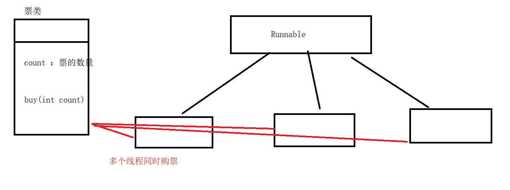
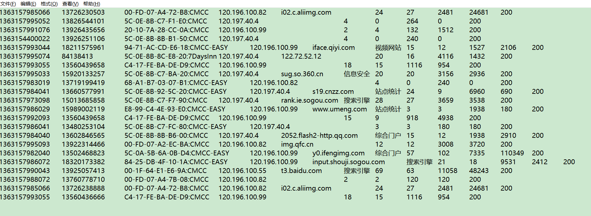

# 作业1：

通过多线程实现交替打印A B A B  各10次 后程序退出

分析：

1. 线程A 和线程B 的打印代码需要同步代码块中
2. 线程A 打印后 notify() wait()   和线程B 之前交替执行
3. 第一次打印和最后一次打印的  wait() notify()   的执行

# 作业2：

设计一个购票系统：可以多个线程同时进行购票，确保购票的业务正确。



数据共享来实现, 需要同步方法或者同步代码块。 

# 作业3:

IO的使用

```
假如d:/a.txt文件中有以下内容：
编号 名称 价格  数量  Product
01,咖啡,20.5,10
02,伴侣,30.8,2
03,咖啡杯,28,5
04,勺子,5.5,5

需求：
1、写程序读取文件中的数据
2、然后将商品信息按照价格由高到低排序
3、将排序结果输出到一个文件中:d:/price_order.txt
4、然后按成交总金额排序，并将排好的数据输出到文件：d:/amount_order.txt
5、最后输出整个文件中的商品信息的汇总成交金额，打印在控制台
01,咖啡,20.5,10 205
02,伴侣,30.8,2  xx
03,咖啡杯,28,5
04,勺子,5.5,5

使用类：
bufferedreader
bufferedwriter
arraylist
product
collections.sort()
```

# 作业4:

日志流量的统计

日志分析



日志格式

访问时间、手机号、MAC地址、IP地址、域名、网站标题、XX、XX、XX、上行流量、下行流量、状态码

需求：

1. 对上面的数据进行规整，保留访问时间、手机号、IP地址、上行流量、下行流量、状态码并保存到文件flow.dat
2. 对规整后的数据进行分析计算出上行总流量、下行总流量、平局上行流量、平均下行流量并保存到文件

分析：

1. 定义一个javabean用来保存规整后的数据
2. 定义一个List用来分析数据


提交格式使用word截图和运行结果截图 。 类的名加上自己姓名拼音

  FlowBean -> ZS_FlowBean


