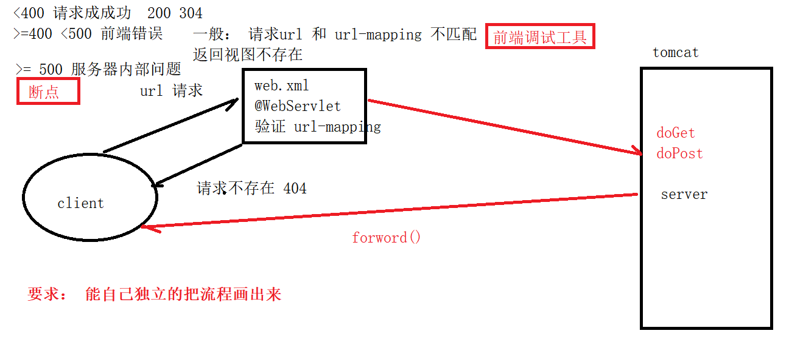
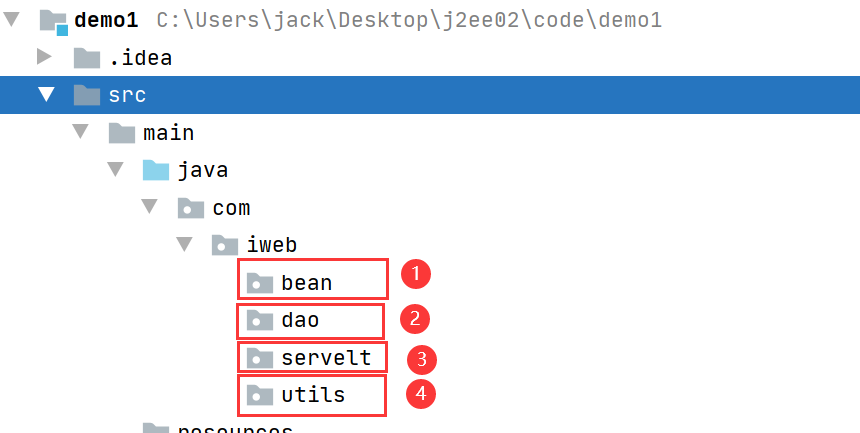
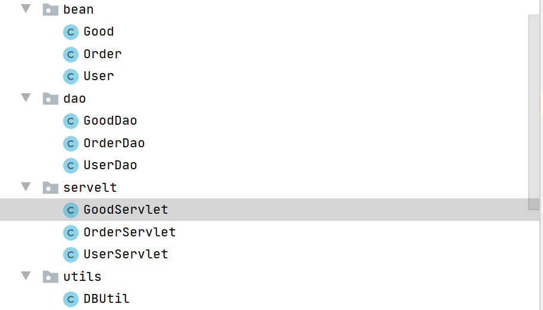

# 回顾

1. Servlet的生命周期： init() ,  doGet()  doPost()  destroy();
2. 网站访问的流程



3. 转发和重定向的区别： 转发持有同一个request对象是一次请求，重定向持有的不是同一个request对象，2次请求
4. Servlet的常用对象： request （一次请求） session（一次会话） application（全局）


# Session的应用场景

电商的购买支付的业务流程：

登录 -> 加入购物车-> 进入购物车支付-> 成功支付

login.jsp（登录） -> item.jsp（商品）-> order.jsp (订单界面) -> success.jsp （支付成功）


表： 商品表、用户表、购物车

商品表: gid、gname、gprice

用户表：uid、uname、upwd

购物车：oid、gid、count、uid

```sql
create table tb_good(
gid int primary key auto_increment,
gname varchar(10),
gprice double
);

create table tb_user(
uid int primary key auto_increment,
uname varchar(10),
upwd varchar(10)
);

create table tb_order(
oid int primary key auto_increment,
uid int,
gid int,
count int,
status int  -- 0 1
)

insert into tb_user values (1,'admin','admin');
insert into tb_user values (1,'user','user');

insert into tb_good values (1,'电脑',5999);
insert into tb_good values (2,'手机',3999);
```

login.jsp： 输入用户名和密码   session.setAttribute(username,uid)

item.jsp： 点击加入购物车  前端发送数据（gid，count）   uid -> session.getAttribue(username)

 order.jsp ： 进入订单 -> 显示用户订单  uid -> session.getAttribue(username)

支付的时候 前端发送 订单id


## 搭建开发环境




1. 数据库表对应的JavaBean
2. dao：数据操作类，进行增删改查  UserDao   GoodDao   OrderDao
3. servlet：业务类，处理用户请求  UserServlet (/user/\*)  GoodServlet(/good/\*)  OrderServlet(/order/\*)
4. utils: DBUtil... 工具类

## 添加依赖

```xml
<dependency>
    <groupId>junit</groupId>
    <artifactId>junit</artifactId>
    <version>4.11</version>
    <scope>test</scope>
</dependency>

<dependency>
    <groupId>javax.servlet</groupId>
    <artifactId>javax.servlet-api</artifactId>
    <version>3.1.0</version>
</dependency>

<dependency>
    <groupId>mysql</groupId>
    <artifactId>mysql-connector-java</artifactId>
    <version>8.0.19</version>
</dependency>
```


完成创建java类




完成DBUtil代码

```java
public class DBUtil {

    private String user = "root";
    private String pwd = "123456";
    private String url = "jdbc:mysql://localhost:3306/test?characterEncoding=utf8&serverTimezone=UTC";
    private String driver = "com.mysql.cj.jdbc.Driver";

    private Connection connection;

    /**
     * 连接数据库
     *
     * @return
     * @throws Exception
     */
    public Connection init() throws Exception {
        // 1. 加载驱动
        Class.forName(driver);
        // 2. 获取会话
        connection = DriverManager.getConnection(url, user, pwd);
        return connection;
    }

    /**
     * 关闭数据库
     */
    public void close() {
        try {
            System.out.println(connection.getAutoCommit()); // true 默认自动事务
            if (connection != null && !connection.isClosed()) {
                connection.close();
            }
        } catch (SQLException e) {
            e.printStackTrace();
        }
    }

    /*手动事务*/
    public void setAutoCommit(boolean flag) {
        try {
            connection.setAutoCommit(flag);
        } catch (SQLException e) {
            e.printStackTrace();
        }
    }

    public void commit() {
        try {
            connection.commit();
        } catch (SQLException e) {
            e.printStackTrace();
        }
    }

    public void rollback() {
        try {
            connection.rollback();
        } catch (SQLException e) {
            e.printStackTrace();
        }
    }
}
```

单元测试

```java
@Test
public void testInit() throws Exception {
    DBUtil dbUtil = new DBUtil();
    Connection connection = dbUtil.init();
    System.out.println(connection);
}
```


用户登录：

1. 根据用户名查询用户
2. 如果用户为空则返回用户不存在
3. 验证密码如果密码不正确则返回密码不正确
4. 将用户保存到session中
5. 返回 item.jsp

PS： 为什么不适用 根据用户名和密码查询 ， 不能确定用户是否存在， 索引维护比较麻烦


UserDao完成

```java
public User selectUserByName(String uname) {
    User user = null;
    DBUtil dbUtil = new DBUtil();
    try {
        Connection conn = dbUtil.init();
        String sql = "select * from tb_user where uname = ?";
        PreparedStatement pst = conn.prepareStatement(sql);
        pst.setString(1, uname);
        ResultSet rs = pst.executeQuery();
        while (rs.next()) {
            user = new User(rs.getInt(1), rs.getString(2), rs.getString(3));
        }
    } catch (Exception e) {
        e.printStackTrace();
    } finally {
        dbUtil.close();
    }
    return user;
}
```

UserServlet

```java
@Override
protected void service(HttpServletRequest req, HttpServletResponse resp) throws ServletException, IOException {

    // 1. 截取url 获取 action
    String url = req.getRequestURI();
    String action = url.replace("/user/", "");
    if ("login".equals(action)) login(req, resp);

}
```

```java
private void login(HttpServletRequest req, HttpServletResponse resp) throws ServletException, IOException {

    String uname = req.getParameter("uname");
    String upwd = req.getParameter("upwd");

    /*
    1. 根据用户名查询用户
    2. 如果用户为空则返回用户不存在
    3. 验证密码如果密码不正确则返回密码不正确
    4. 将用户保存到session中
    5. 返回 item.jsp
     */
    UserDao userDao = new UserDao();
    User user = userDao.selectUserByName(uname);
    if (user == null) {
        req.setAttribute("message", "用户不存在");
        req.getRequestDispatcher("/login.jsp").forward(req, resp);
        return;
    }

    if (!upwd.equals(user.getUpwd())) {
        req.setAttribute("message", "密码不正确");
        req.getRequestDispatcher("/login.jsp").forward(req, resp);
        return;
    }

    HttpSession session = req.getSession();
    session.setAttribute("uid", user.getUid());

    req.getRequestDispatcher("/item.jsp").forward(req, resp);
}
```


显示商品列表

1. 用户登录成功后返回商品列表之前要请求商品数据
2. 返回商品列表页面


GoodDao完成 selectGoods（）

```java
public List<Good> selectGoods() {
    List<Good> list = new ArrayList<>();

    DBUtil dbUtil = new DBUtil();
    try {
        Connection conn = dbUtil.init();
        String sql = "select * from tb_good";
        PreparedStatement pst = conn.prepareStatement(sql);
        ResultSet rs = pst.executeQuery();
        while (rs.next()) {
            list.add(new Good(rs.getInt(1), rs.getString(2), rs.getDouble(3)));
        }
    } catch (Exception e) {
        e.printStackTrace();
    } finally {
        dbUtil.close();
    }
    return list;
}
```

做单元测试（不要偷懒）

完成GoodServlet


```java
@Override
protected void service(HttpServletRequest req, HttpServletResponse resp) throws ServletException, IOException {

    // 1. 截取url 获取 action
    String url = req.getRequestURI();
    String action = url.replace("/good/", "");
    if ("selectGoods".equals(action)) selectGoods(req, resp);

}
```


```java
private void selectGoods(HttpServletRequest req, HttpServletResponse resp) throws ServletException, IOException {
    GoodDao goodDao = new GoodDao();
    List<Good> list = goodDao.selectGoods();
    req.setAttribute("good", list);
    req.getRequestDispatcher("/list.jsp").forward(req, resp);
}
```


显示商品明细  http://localhost:8080/good/selectGoodById   GET  ?gid=1

1. 根据id显示

servlet 代码

```
if ("selectGoodById".equals(action)) selectGoodById(req, resp);
```

```java
private void selectGoodById(HttpServletRequest req, HttpServletResponse resp) throws ServletException, IOException {
    Integer gid = Integer.parseInt(req.getParameter("gid"));
    GoodDao goodDao = new GoodDao();
    Good good = goodDao.selectGoodById(gid);
    req.setAttribute("good", good);
    req.getRequestDispatcher("/item.jsp").forward(req, resp);
}
```

GooDao代码

```java
public Good selectGoodById(Integer gid) {

    Good good = null;

    DBUtil dbUtil = new DBUtil();
    try {
        Connection conn = dbUtil.init();
        String sql = "select * from tb_good where gid = ?";
        PreparedStatement pst = conn.prepareStatement(sql);
        pst.setInt(1, gid);
        ResultSet rs = pst.executeQuery();
        while (rs.next()) {
            good = new Good(rs.getInt(1), rs.getString(2), rs.getDouble(3));
        }
    } catch (Exception e) {
        e.printStackTrace();
    } finally {
        dbUtil.close();
    }

    return good;
}
```


订单功能

前端发送 gid count 请求 Order，在服务器端session 获取 uid 完善数据 保存到 数据库 返回 order.jsp

item.jsp

```html
<h1>item</h1>
<%
    Good good = (Good) request.getAttribute("good");
%>
<form action="/order/add" method="post">
    <input type="hidden" name="gid" value="<%=good.getGid()%>">
    商品名称: <%=good.getGname()%>; 商品价格:<%=good.getGprice()%>;订单数量:
    <input type="number" name="count" value="1">
    <input type="submit" value="加入购物车">
</form>
```


OrderServlet

```java
@Override
protected void service(HttpServletRequest req, HttpServletResponse resp) throws ServletException, IOException {

    // 1. 截取url 获取 action
    String url = req.getRequestURI();
    String action = url.replace("/order/", "");

    if ("add".equals(action)) addOrder(req, resp);


}

private void addOrder(HttpServletRequest req, HttpServletResponse resp) throws ServletException, IOException {
    Integer gid = Integer.parseInt(req.getParameter("gid"));
    Integer count = Integer.parseInt(req.getParameter("count"));

    HttpSession session = req.getSession();
    Object uid = session.getAttribute("uid");
    if (uid != null) {
        // 完善数据
        Order order = new Order();
        order.setGid(gid);
        order.setCount(count);
        order.setUid(Integer.parseInt(uid.toString()));

        OrderDao orderDao = new OrderDao();
        orderDao.save(order);
        req.getRequestDispatcher("/order.jsp").forward(req, resp);
    } else {
        req.getRequestDispatcher("/login.jsp").forward(req, resp);
    }

}
```


OrderDao

```java
public void save(Order order) {

    String sql = "insert into tb_order (uid,gid,count,status) values (?,?,?,?)";

    DBUtil dbUtil = new DBUtil();
    try {
        Connection connection = dbUtil.init();
        PreparedStatement pst = connection.prepareStatement(sql);
        pst.setInt(1, order.getUid());
        pst.setInt(2, order.getGid());
        pst.setInt(3, order.getCount());
        pst.setInt(4, order.getStatus());

        pst.executeUpdate();

    } catch (Exception e) {
        e.printStackTrace();
    } finally {
        dbUtil.close();
    }

}
```


显示订单：是由下单成功后重定向  http://localhost:8080/order/selectOrders

增加一个功能在订单页面 点击刷新按钮 刷新订单，可以手动到数据库增加一条数据来验证

作业


支付功能完成 支付后回到订单也 支付的订单显示 支付成功(1)

作业


