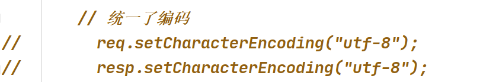

# ajax请求（重要）

定义： 是由页面内部发起的请求，不会被用户感知，数据返回是通过 HttpServletResponse 。<font color=red>不返回视图路径</font>

request： 用户主动发起的请求，返回视图。 数据是通过 HttpServletRequest HttpSession application


请求是通过js来完成：

```js
$.ajax({
    url: "/info",  // 请求url
    type: "POST", // 请求方式  POST GET
    data: {name: "admin", pwd: "123456"}, // 请求参数  js 对象
    // dataType: "text", // 返回参数类型
    // dataType: "xml",
    dataType: "json",
    async: false, // 默认为true 是异步的  如果需要同步 设定为 false
    success: function (data) { // 回调函数, 当请求成功后会将数据在这个函数中返回
        console.log(typeof data);
        console.log(data);
    }
})
```

 servlet 端数据响应

dataType: "text"

```java
PrintWriter writer = resp.getWriter();
writer.println("hello box");
writer.flush();
writer.close();
```


dataType: "xml"

```java
String xml = "<?xml version=\"1.0\" encoding=\"UTF-8\" ?>\n" +
        "<beans>\n" +
        "    <bean>\n" +
        "        <property name=\"name\" value=\"admin\"/>\n" +
        "        <property name=\"pwd\" value=\"123456\"/>\n" +
        "    </bean>\n" +
        "    <bean>\n" +
        "        <property name=\"name\" value=\"jack\"/>\n" +
        "        <property name=\"pwd\" value=\"123456\"/>\n" +
        "    </bean>\n" +
        "</beans>";
PrintWriter writer = resp.getWriter();
writer.println(xml);
writer.flush();
writer.close();
```

xml格式的前端解析

```js
$(data).find("bean").each(function (index, el) {
    let name1 = $($(el).find("property")[0]).attr("name");
    let value1 = $($(el).find("property")[0]).attr("value");
    console.log(name1 + "->" + value1);
    let name2 = $($(el).find("property")[1]).attr("name");
    let value2 = $($(el).find("property")[1]).attr("value");
    console.log(name2 + "->" + value2);
})
```


dataType: "json"  ， 添加依赖

```xml
<dependency>
    <groupId>com.alibaba</groupId>
    <artifactId>fastjson</artifactId>
    <version>1.2.68</version>
</dependency>
```

```java
List<User> users = Arrays.asList(
        new User(1, "jack", 20),
        new User(2, "tom", 30));

// 将users 转成json
String json = JSON.toJSONString(users);
System.out.println(json);

PrintWriter writer = resp.getWriter();
writer.println(json);
writer.flush();
writer.close();
```

json格式的解析

```js
/*json解析： jQuery 会帮助我们将 json字符串*/
for (let i = 0; i < data.length; i++) {
    console.log(data[i].id + "\t" + data[i].name + "\t" + data[i].age);
}
```


返回数据的格式：

1. 文本格式：text，结构简单，不能表示复杂的数据结构比如说对象。
2. xml格式：xml，结构复杂，可以表示对象。解析比较麻烦。
3. json格式（常用）：json，结构简单，可以表示复杂对象，解析简单。 传输速度块


## JSON数据格式

json数组:

js:可以看作是一个数组，java：看作是list

```json
[1,2,3,4] 
[
    {id:"1",name:"jack"},
    {id:"2",name:"tom"}
]
```

json对象：

js：看作是一个对象，java：看作是一个对象或者map

```json
{
    id:1,
    name:"jack",
    age:20
}
```


java中对json的解析： demo2

js与json:demo3


# jQuery对ajax的封装


```
jQuery.getJSON(url, [data], [callback])
直接返回的就是json  默认的请求方式 是 get

返回值:XMLHttpRequestjQuery.get(url, [data], [callback], [type])
默认 get  指定返回格式 
返回值:XMLHttpRequestjQuery.post(url, [data], [callback], [type])
默认 post  指定返回格式 
```


# ajax请求的底层原理（了解）

ajax是基于 XMLHttpRequest对象

https://www.runoob.com/ajax/ajax-xmlhttprequest-response.html

# 过滤器（理解）

过滤器需要实现接口 Filter  重写 doFilter()

编写过滤器

```java
@WebFilter(value = "/hi", initParams = {
        @WebInitParam(name = "user", value = "scoot"),
        @WebInitParam(name = "pwd", value = "123456")
})  // 过滤的请求url   如果说要过滤所有  /*
public class UserFilter implements Filter {

    /**
     * 服务器 启动的时候执行 只会执行一次, 在servlet之前
     *
     * @param filterConfig : 可以获取初始化的时候设置的参数
     * @throws ServletException
     */
    @Override
    public void init(FilterConfig filterConfig) throws ServletException {
        System.out.println("UserFilter init");
        // 获取参数
        String user = filterConfig.getInitParameter("user");
        String pwd = filterConfig.getInitParameter("pwd");
        System.out.println(user + "\t" + pwd);
    }

    /**
     * 每次请求的时候调用, 在servlet之前
     *
     * @param request
     * @param response
     * @param chain
     * @throws IOException
     * @throws ServletException
     */
    @Override
    public void doFilter(ServletRequest request, ServletResponse response, FilterChain chain) throws IOException, ServletException {
        System.out.println("doFilter");

        // 放行: 是否放行决定于上面的业务代码
        chain.doFilter(request, response);
    }

    /**
     * 服务器关闭的时候, 在servlet 之后
     */
    @Override
    public void destroy() {
        System.out.println("destroy");
    }
}
```


举例1：使用过滤器实现解决乱码问题

```java
@WebFilter("/*")
public class EncodeFilter implements Filter {
    @Override
    public void init(FilterConfig filterConfig) throws ServletException {

    }

    @Override
    public void doFilter(ServletRequest request, ServletResponse response, FilterChain chain) throws IOException, ServletException {
        // 处理乱码
        request.setCharacterEncoding("utf-8");
        response.setCharacterEncoding("utf-8");
        chain.doFilter(request, response);
    }

    @Override
    public void destroy() {

    }
}

```

使用过滤器避免了每个servlet中都进行编码处理，而是在过滤中统一处理



举例2： 用户登录成功后，修改用户基本信息等需要验证的操作，使用filter实现验证用户是否登录

1. 用户登录
2. 修改密码
3. 修改地址


# 监听器（理解）


