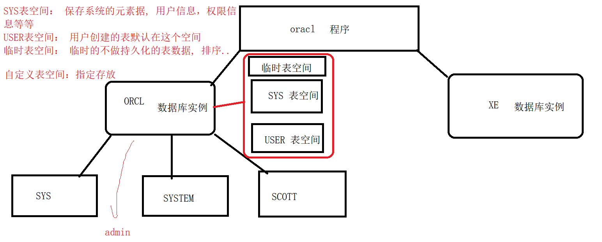
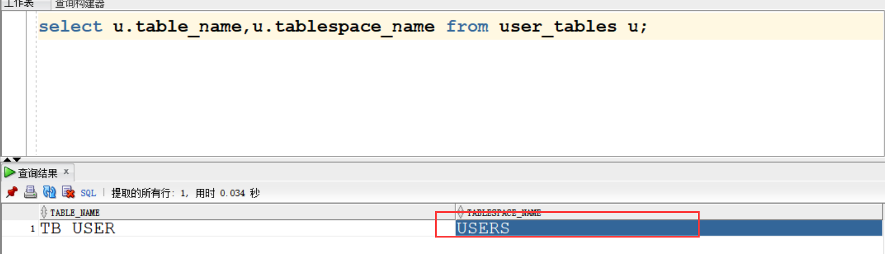
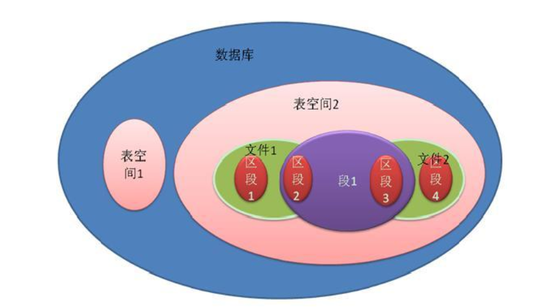
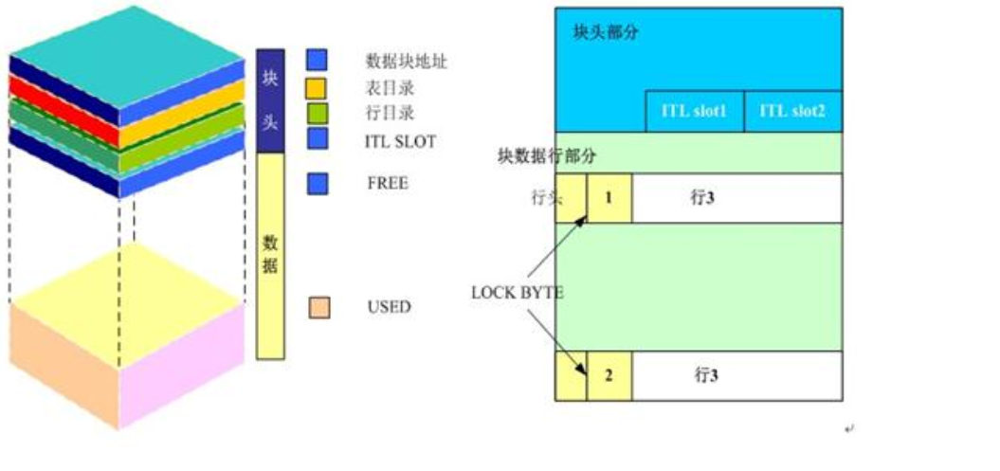

# 数据库的用户

DBA : 超级管理

SYSTEM：管理员用户

op：普通用户


# 数据库角色(身份)：

拥有一系列权限的身份。

DBA : 超管

RESOURCE ： 资源权限(建表，对表操作等等)

CONNECT: 登录


# 数据库权限：

登录、新增、删除、创建用户... 你能做什么


# 创建用户

几个常用命令

```
show user; // 查看当前用户
conn username/password@orcl [as sysdba]  // 切换用户
select * from tab; // 查看当前用户下所有的对象
select * from user_tablespaces; // 查询所有表空间
```


创建用户只能用SYSDBA身份的账户进行创建。

**使用SYSDBA登录**

```
sqlplus sys/123456@orcl as sysdba;
```

创建用户 create 

```
create user test identified by "123456";
```

授权

```
grant [权限/角色] to username;
grant CREATE SESSION to test;
grant resource to test;
```

撤销权限

```
revoke [权限/角色] from username;
```

新建一个用户 需要授权 connect 、 resource , 拥有一个用户常用的权限。


# 了解一下oracle的体系






创建用户指定默认表空间(只能在用户创建的时候指定)：

1. 创建表空间
2. 创建用户指定表空间
3. 授权 connect、resource
4. 使用新用户登录
5. 创建表
6. 查询表空间

**练习一下**

SYS操作

```sql
select * from all_users;
drop user jack cascade; -- 删除用户同时删除用户的数据
select * from user_tablespaces;
drop tablespace xiaohei including contents and datafiles; -- 删除表空间及文件

-- 创建表空间
create tablespace ts_jack
datafile 'C:\oracle\product\10.2.0\oradata\orcl\ts_jack.dbf'
size 10M 
autoextend  on next 10M 
maxsize 100M
extent management local; 

-- 创建用户指定表空间
create user jack identified by "123456" default tablespace ts_jack;

-- 授权
grant connect,resource to jack;

-- 针对商品专门使用一个表空间
create tablespace ts_jack_good
datafile 'C:\oracle\product\10.2.0\oradata\orcl\ts_jack_good.dbf'
size 10M 
autoextend  on next 10M 
maxsize 100M
extent management local; 
```

JACK操作

```sql
-- 创建表
create table tb_user(
id int primary key,
name varchar2(10),
birth date
);

select u.table_name,u.tablespace_name from user_tables u;

-- 创建表指定表空间
create table tb_good(
gid int primary key,
gname varchar2(10)
) tablespace ts_jack_good;

```


# 表空间的原理说明




数据块： oracle最小的存储单元，一行数据可以存放在多个块中。至少存储一个块





# 函数

```sql
-- 函数的测试 使用 dual
select concat('hello ',' world') from dual;

select sal from emp;
select empno,rpad(sal,10,'*') from emp;

select initcap('admin') from dual;
select initcap(ename) from emp;
select length(ename) from emp;
select substr('abcdefg',3,4) from dual;
select instr('corporate floor','or', 2) from dual;
select length(trim('   abc   ')) from dual;
select trim('s' from 'sabcs') from dual;
select sysdate from dual;
select systimestamp from dual;

select to_char(sysdate,'yyyy-mm-dd hh24:mi:ss') from dual;

select nlssort('a','c','b') from dual;
select  next_day(sysdate,'星期二') from dual;
```

其他的函数

```sql
-- 获取日期中指定的属性
select extract(year from sysdate) from dual;
select extract(month from sysdate) from dual;
-- case when   : 10 - 开发  20 销售  30 人事  保安
select ename,deptno,
case deptno
when 10 then '开发' 
when 20 then '销售'
when 30 then '人事'
else '保安' end
from emp ;

-- over()  了解
select ename,deptno, max(sal) over() from emp;
-- over(partition by deptno) 分区
select ename,deptno, max(sal) over(partition by deptno) from emp;
-- row_num() over() : 每个部门工资前2名的员工
select a.*,rownum from 
(select e.ename,e.sal,e.deptno from emp e order by e.sal) a  where rownum<=2;

select * from 
(select ename,deptno, row_number() over(partition by deptno order by sal) rn from emp)a
where a.rn <=2;

```

